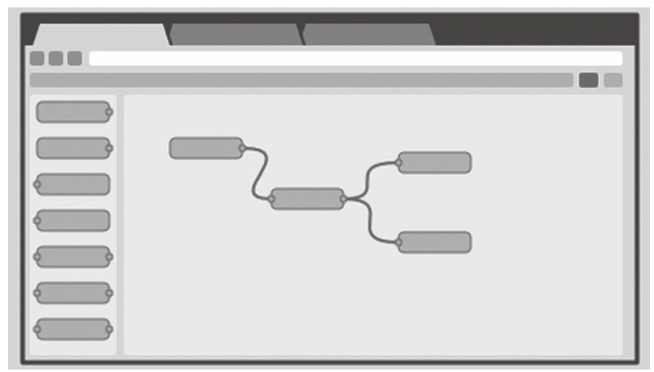
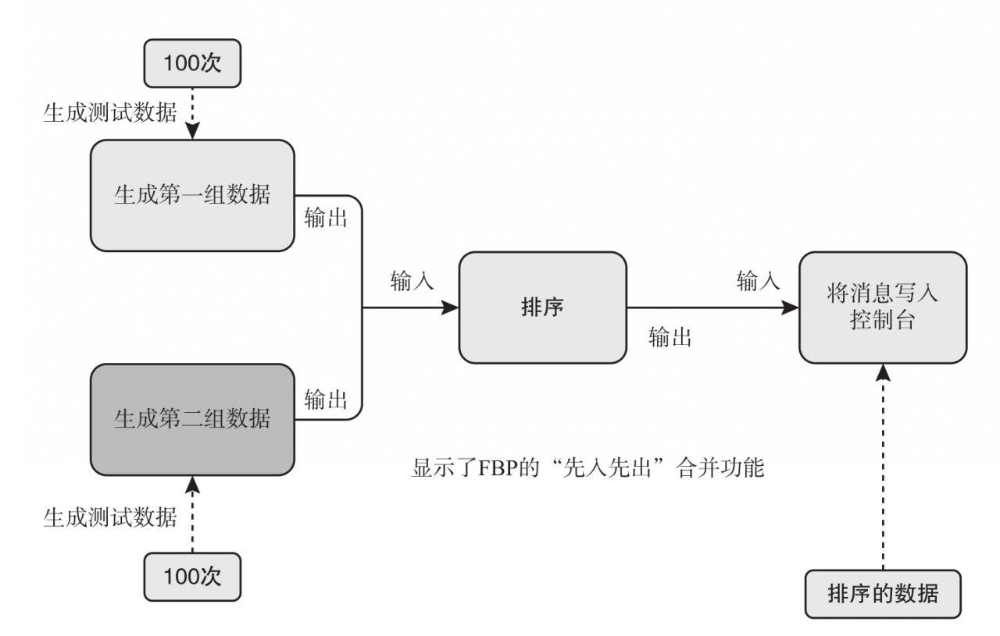
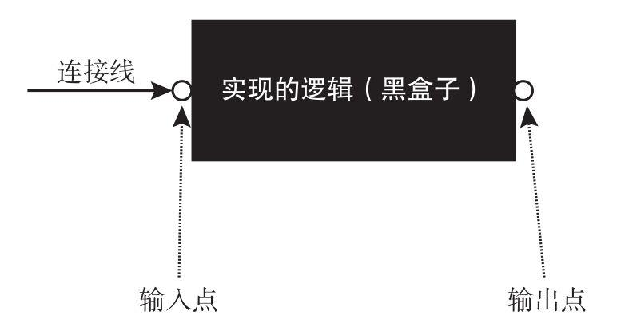
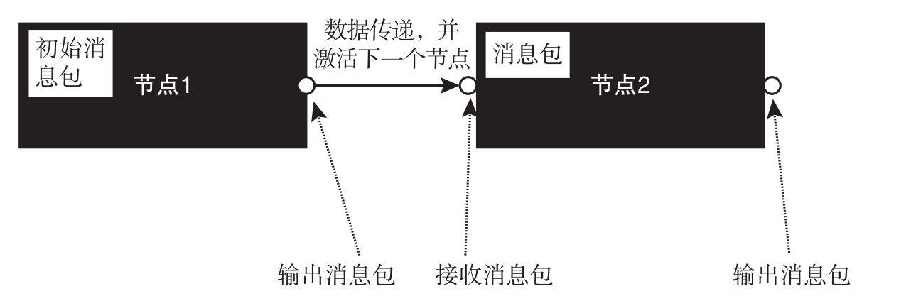
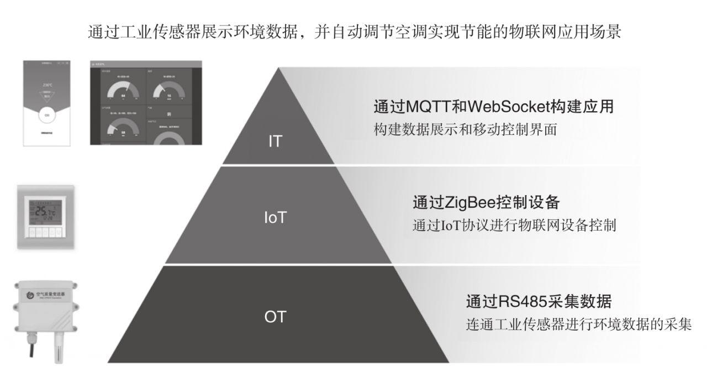
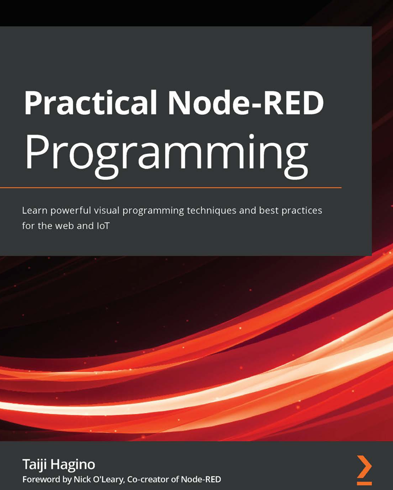

# Node-Red 实战编程（Practical Node-RED Programming）中文版

## 1. Node-RED

Node-RED 作为一个开源项目在推出后获得了巨大的成功和广泛的支持，它的跨界能力和全新的开发方式成为最大的特点。Node-RED 可以轻松实现工业控制、物联网、网络通信、信息化等多种跨界融合场景的应用，同时使用了低代码平台和流程化引擎的全新方式进行开发。 在深入学习 Node-RED 之前，本章先介绍什么是 Node-RED、Node-RED 的发展历史以及 Node-RED 的十大特性，帮助读者初步认识 Node-RED，为后续实战和进阶做好理论基础准备。

### 1.1 什么是 Node-RED

Node-RED 是一个开源的可视化编程工具，用于连接物联网（IoT）设备、API 和在线服务。 随着物联网的快速发展，越来越多的设备需要连接和交互。 传统的编程方法需要处理大量的底层细节，如网络协议、数据格式和设备驱动程序，这使物联网应用程序的开发变得非常复杂。Node-RED 通过提供可视化的编程方式和大量的现成节点库，为物联网设备的连接和交互提供了一种简单而灵活的方式。

Node-RED 提供了一个基于流程的编程环境，支持通过拖曳和连接不同的节点，创建物联网应用程序、自动化流程和完成数据处理任务。Node-RED 的核心是一个基于浏览器的图形界面，支持用户创建和编辑流程。 每个流程由一个或多个节点组成，节点代表不同的功能或操作。 用户可以从大量的内置节点库中选择节点，这些节点包括传感器、数据库操作、数据转换、网络通信等。 用户可以根据需求将这些节点拖曳到工作区中，并使用连接线将它们连接起来。Node-RED 的出现使物联网设备的连接和交互变得更加简单和快速，不需要编写大量的底层代码，同时还提供了易于使用的 Web 界面，使非技术人员也可以轻松地创建和编辑流程。 因此，Node-RED 成为物联网开发中不可或缺的一部分，受到了广泛关注。 在过去的几年中，围绕 Node-RED 已经形成了一个活跃的开源社区，并在不断发展和完善中。

### 1.2 Node-RED 的发展历史

Node-RED 的发展历史可以追溯到 2013 年，它是由 IBM Emerging Technology 团队的 Nick O'Leary 和 Dave Conway-Jones 开发的。 他们的目标是创建一个简单易用的工具，用于连接物联网设备和在线服务。 利用传统的编程方法，处理物联网设备之间的数据流和通信过于复杂和烦琐。 因此，他们提出了一种基于流程的编程范式，通过图形化界面以节点和连接线的形式来表示数据流和操作。 这种可视化编程方法使开发者可以更直观地构建物联网应用程序，并且不需要编写复杂的代码。 图 1-1 为 Node-RED 创始人 Nick O'Leary 和 Dave Conway-Jones。

图 1-1 Node-RED 创始人 Nick O'Leary 和 Dave Conway-Jones

2014 年，IBM 将 Node-RED 开源并捐赠给了 OpenJS 基金会。 这一举动引起了广泛关注，吸引了全球开发者社区的参与，得到了全球范围内的推广和应用。

Node-RED 的开源发布以及简单易用的特性，使它迅速受到物联网领域的欢迎。 开发者可以使用 Node-RED 构建各种物联网应用程序、自动化流程和完成数据处理任务，而不需要花费大量的时间和精力来编写复杂的代码。

随着时间的推移，社区成员不断扩展和改进 Node-RED 的功能，创建了丰富的节点库和插件，增加了与各种第三方服务和设备集成的能力。

至今，Node-RED 已经成为物联网领域广泛应用的工具之一。 它的第三方扩展节点库已经超过 4000 个，下载安装量已经超过 2.3 亿次（截至 2022 年年底）。

### 1.3 Node-RED 的十大特性

#### 1.3.1 可视化编程

Node-RED 提供了一个基于浏览器的流程编辑器，利用该编辑器，不仅可以非常方便地将面板上丰富的节点组装成流程，而且可以通过一键部署功能，将其安装到运行环境中。 利用其中的富文本编辑器，用户可以创建 JavaScript 函数。 预置的代码库可用于保存有用的函数、模板和可复用的流程。

也就是说，使用 Node-RED 不需要安装任何其他软件，直接通过浏览器就可以使用。 由于 Node-RED 编辑器具有 WebSocket 等 HTML5 的特性，因此需要选择 WebKit 内核的浏览器，如 Chrome 浏览器、IE Edge 浏览器、 360 浏览器极速模式、Safari 浏览器等。 注意，IE 11 之前的版本无法使用。关于可视化编程的编辑器将在第 4 章进行讲解。 图 1-2 是基于浏览器的流程编辑器示意图。

#### 1.3.2 基于流程引擎

Node-RED 内置了一个功能强大的规则引擎，支持用户定义条件和触发器，实现自动化和响应式的流程。 这使用户可以根据特定的规则来控制和操作流程中的节点。 这种方式叫基于流的编程（Flow Based Programming，FBP），它是一种基于组件的软件工程方法， 由 J. Paul Morrison 在 IBM 工作时创建。 在详细了解 Node-RED 之前，我们先简单介绍一下 FBP。 虽然 FBP 创建的时间非常早，但是直到今天才逐渐被广泛采用，主要原因是当前物联网应用的爆发，要求快速开发更多物联网中间件、物联网平台、边缘计算网关等面向各种物理硬件设备的项目，而 FBP 的特性十分适合这些场景，因此 Node-RED 设计的基础就是 FBP 的开发模式。

FBP 不是具体的开发语言，也不是开发工具，只是一种编码方式。 常见的编码方式还有面向脚本的方式、面向过程的方式、面向对象的方式。 面向对象的编码方式是当前最为流行且应用广泛的编程方式。 大家熟悉的 Java 就是基于面向对象的编码方式发明的语言，其他主流语言如 PHP、Python、Go 等都有框架来支持面向对象的编码方式。 这种方式主要适用于应用级系统的开发，用在物联网和底层的通信级别的开发中将会显得「笨拙」，也不适用于有大量物联网数据的场景，以及有不同协议交换的场景或设备控制的场景。

FBP 是将程序概念化为由一系列节点和连接线组成的流程图，通过图形化的方式进行组装，利用图形化、流程化、组件、连接点、消息包等主要概念完成整个系统的开发和调试。 FBP 使用图形来表示程序的结构。 节点是组件的实例，节点之间通过端口连接。 一个节点上的输出端口只能连接到另外一个节点的输入端口。 图形被构建为程序的静态视图，该视图在运行环境中运行。 目前，一些编辑 FBP 流程图的工具如 DrawFBP、NoFlo 等可视化工具，也可以使用文本语言 XML 格式进行构建。 基于 FBP 的图形创建工具 DrawFBP 的工作流程如图 1-3 所示。

图 1-3 基于 FBP 的图形创建工具 DrawFBP 的工作流程

图形化是一种非常适合视觉表达的方式，使用户可以更容易地理解流程。 如果能把一个问题分解成离散的步骤，就可以创建一个流程，并知道它在做什么，而不必理解每个节点对应的每行代码。

组件是 FBP 的基础模块。 下面介绍一些基本组件，这些组件通常是用传统编程语言编写的类、函数或小程序。 每个组件包含实现的逻辑（黑盒子）、连接线、输入点、输出点 4 个部分， 如图 1-4 所示。

1）节点（黑盒子）：每个组件代表一项已经开发好的功能代码，类似一个黑盒子，用户不需要关心里面的运行过程，只需要关注实现的功能。 这个「黑盒子」在 FBP 中又名「节点」。 一个 FBP 流程可以用到多个同一种组件（比如 function 组件、change 组件等）的节点，每个节点都是一个独立的组件实例。

图 1-4 FBP 组件示例

2）输入点：每个「黑盒子」可以有 0 个、1 个或多个输入点，是外界将信息传递进节点的地方。 如果节点的输入点数量是 0，表示这是流程的第一个节点，即开始节点。 该节点可以通过自动或者手动的方式启动。

3）输出点：每个「黑盒子」可以有 0 个、1 个或多个输出点，是节点对外输出结果的地方。 如果节点的输出点数量为 0，表示该节点为流程分支上的最后一个节点，执行完毕后不需要输出信息。

4）连接线：连接线是连接节点的输出点和输入点的连线，程序会按照连线的顺序执行。 连接线具有一对一、一对多、多对一的形式。 连接线具有节点合并和节点拆分两个功能。

■ 节点合并：当两个或多个输出点需要连接到节点上的单个输入点时，必须进行某种形式的合并。 可以添加一个合并节点（具有多个输入点），将消息包按到达顺序发送到单个输入点，或者将接收节点上的单个输入点替换为阵列输入点。 也可以提供自动合并功能。

■ 节点拆分：当一个输出点需要连接到多个输入点时，数据包需要被拆分，为了实现这一目的，需要一个能够拆分数据包的组件。 它可以创建一个数据包的副本并将其发送到每个连接的输出点。 运行时可以提供此功能，而不需要显式组件来完成。

消息包是各个节点之间传递的数据包。 该数据包可以包括各种通用的数据结构，比如 String 类型、JSON 类型、Num 类型等。 当然，JSON 是最为常用的格式，因为可以在每个节点去扩展，修改里面的数据项，方便实现不同的功能要求。

在一个 FBP 图中，每个流程都可以有一个初始消息包作为最开始的数据进行配置。 在流程启动之前，它不会生效，只有通过手动或者自动触发的方式启动。 流程启动后，初始消息包才开始生效，并按照流程向下传递。

当节点的输入点有数据传入时，该节点被激活。 节点被激活后开始执行任务，当任务完成后返回修改过的数据包，然后继续向后传递。 消息包传递过程如图 1-5 所示。

图 1-5 消息包传递过程

#### 1.3.3 基于低代码开发平台

Node-RED 提供了流程可视化配置加部分低代码方式来完成整个工作，只需要用户掌握简单的 JavaScript 编程语言，编写少量代码就可实现各种定制化的智能场景需求。

在使用 Node-RED 之前，我们还需要了解一下低代码开发平台。 低代码是现在最为流行的一种开发方式。 顾名思义，低代码开发平台（Low-Code Development Platform，LCDP）是不需要编码（ 零代码）或编写少量代码就可以快速生成应用程序的开发平台。 这是通过可视化工具进行应用程序开发的方法，使拥有不同经验、水平的开发人员可以通过图形化的界面，使用拖曳组件和模型驱动的逻辑完成应用程序的创建。

目前，流行的低代码平台非常多，如国内市场中奥哲的云枢、阿里巴巴的宜搭、百度的爱速搭、华为的应用魔方、腾讯的微搭、帆软的简道云、泛微的 E-Builder、金蝶的金蝶云·苍穹、浪潮的 iGIX、用友的 YonBIP 等，以及国外市场中微软的 PowerApps，谷歌的 App Maker、Mendix、OutSystems 等。

低代码平台之所以这么受欢迎，一方面是因为提高了开发效率，另一方面是因为可以让一些非全栈技术的开发工程师快速参与到项目中，改变了传统产品开发中从用户提出需求到需求分析师完成整理、 前端设计工程师进行原型设计、后台开发工程师开发后台服务和数据库，再到交付客户审核、通过后部署上线的团队分工模式。 这种传统方式要求每个工种都需要具备专业能力，并且整个消息传递流程非常长，从用户提出需求到体验再到结果至少需要一个月以上，最糟糕的是客户在实际使用过程中，一些细微的改进也需要经过这样的流程，导致系统优化和个性化随着上线时间越长越难以实现。 上面提到的流行的低代码平台一般用于客户的业务系统和内部办公协作系统的开发。

Node-RED 是一款专门为物联网开发提供支持的低代码平台。 一个物联网应用基本涉及 3 个技术领域：信息技术（IT）、物联网（IoT）技术、运营技术（OT）。 图 1-6 描述了一个典型的物联网应用的技术使用和相互配合的示例。

图 1-6 典型的物联网应用的技术使用和相互配合的示例

Node-RED 将这三个领域的技术简单地连接到了一起，支持通过极少的代码或者零代码完成一个常见的物联网应用系统的开发。 同时，IT 工程师、OT 工程师、IoT 工程师都可以通过 Node-RED 快速熟悉本领域之外的技术知识，通过可视化和流程化的方式清晰地了解整个物联网系统的运行逻辑和过程，为物联网数字化时代做好技术储备。

#### 1.3.4 强大的节点库

Node-RED 拥有一个庞大的节点库，其中包含具有各种功能、完成各种操作的节点，例如传感器、数据库操作、网络通信、数据转换等。 用户可以根据需求选择适当的节点来构建流程。 节点库包含核心内部节点、官方扩展节点和第三方扩展节点。 目前，第三方扩展节点已经超过 4000 个，覆盖了物联网和信息集成的方方面面。

#### 1.3.5 支持多种数据格式

Node-RED 支持多种常见的数据格式（包括 JSON、XML、CSV 等），方便用户在流程中进行数据的处理和转换。 而这些数据格式在大多数其他系统中都是通用的，特别是 JSON 格式。

#### 1.3.6 基于 Node.js 的开放性和可扩展性

Node-RED 采用了基于 Node.js 的轻量化运行环境，充分继承了事件驱动和非阻塞模型的优点，不仅能运行在云平台中，也能非常好地运行在像树莓派这类位于网络边缘的低功耗硬件设备上。借助超 22 万的既有 Node.js 模块资源，可使组件面板类型以及整个工具能力的扩展变得非常容易。

Node-RED 虽然是基于 Node.js 环境开发完成的，但这并不意味着使用 Node-RED 也需要学习 Node.js 技术。 大多数情况下，直接使用已经开发好的组件并编写少量 JavaScript 代码即可满足需求。

#### 1.3.7 轻量级和跨平台

Node-RED 以 Node.js 为运行环境，具有轻量级和高效的特点。 它可以在多种操作系统上运行，简单来说，只要能够运行 Node.js 环境，就可以轻松部署 Node-RED，同时系统资源要求极低（在 512MB 内存环境中就可以运行）。因此，很多物联网边缘网关产品也开始搭载 Node-RED。 第 2 章将详细讲解在各种操作系统下安装和运行 Node-RED 的方法。

#### 1.3.8 集成多种协议和通信方式

Node-RED 支持多种常见的通信协议（包括连接设备的 Modbus、KNX、BACnet、ZigBee、LoRa、UDP、TCP/IP 等，连接服务的 HTTP、WebSocket、MQTT 等）， 可以方便地与不同类型的设备和服务进行交互。 这些协议通信都是由不同的 Node-RED 节点来完成的。 这部分内容可以参考第 6 章的核心内部节点介绍。

#### 1.3.9 社区支持和丰富的生态系统

Node-RED 拥有庞大的用户群体，支持用户在社区中获取帮助、交流经验，并共享自己的节点和流程。 此外，Node-RED 还有丰富的生态系统，提供了各种插件和扩展，扩展了功能和应用范围。 所有的 Node-RED 流程都可以方便地使用 JSON 格式保存，这使其非常易于导入、导出以及与他人分享。同时，Node-RED 3.02 版本目前已经有超过 4065 个第三方开发的节点供自由下载和使用。 整个 Node-RED 平台只要按照 Apache License 2.0（Apache 2.0 开源协议）的要求即可无障碍地部署到个人开发环境或者商业开发环境中进行使用。

> 注意：Apache 2.0 开源协议的核心内容是，以保护和尊重原作者的著作权为主要目的。 对使用、复制、修改、商用不做过多限制，但必须包含原著的 License 信息。公司或项目在使用 Apache License 2.0 授权的开源软件时，不能隐瞒、删除，甚至修改原作者的著作权信息。 基于该开源软件发布的衍生作品所产生的任何法律问题与其他的贡献者无关。 具体细节可以参考 https://www.apache.org/licenses/LICENSE-2.0。

#### 1.3.10 可部署性和可扩展性

Node-RED 可以轻松部署到各种环境中，包括本地计算机、云服务器和物联网设备等。 它具有良好的可扩展性，可以应对不同规模和需求的项目。 因此，一个完整的物联网项目中（包括云端物联网平台、本地物联网平台、边缘物联网网关、物联网开发环境等）可以部署多个 Node-RED 来协同工作。在不同的硬件上运行 Node-RED 保持了操作的一致性，以便形成项目化和产品化能力。

## 2. Node-Red 实战编程（Practical Node-RED Programming）

这本书最适合那些第一次学习无代码/低代码编程工具的软件编程人员。Node-RED 是一个基于流的编程工具，这个工具可以轻松构建任何软件应用程序的 Web 应用程序，如物联网数据处理，标准 Web 应用程序，Web API 等。因此，这本书将帮助 Web 应用程序开发人员和物联网工程师。

### 英文版下载地址

[阿里云盘：Practical Node-RED Programming ](https://www.alipan.com/s/rovNackbumw)

### apachecn-node-zh

这本书参考了 [**飞龙** 的译文](https://github.com/apachecn/apachecn-node-zh/blob/master/docs/prac-node-red-prog/README.md).

## 3. 阅读《Node-Red 实战编程》中文版

本书《Node-Red 实战编程》中文版 部署在[ReadTheDocs](https://readthedocs.org/)。

点击阅读 [《Node-Red 实战编程》中文版 ](https://apachecn-node-zh.readthedocs.io/zh-cn/latest/)

## 4. Github 源码

本书《Node-Red 实战编程》中文版 [Github 源码仓库](https://github.com/lybhb8/apachecn-node-zh/tree/node-red).

## 5. License

本书《Node-Red 实战编程》中文版 在 [GPL-3.0](./LICENSE) 协议下授权.

## 联系方式

波波林 QQ ：1341979804.
