# 三、通过创建基本流来理解 Node-RED 特性

在本章中，我们将实际使用 Node-RED flow Editor 创建一个流。 通过创建一个简单的流程，您将了解如何使用该工具及其特征。 为了更好地理解，我们将创建一些示例流。

从现在开始，您将使用 Node-RED 创建称为流的应用。 在本章中，您将学习如何使用 Node-RED 以及如何创建一个应用作为流。 为此，我们将涵盖以下主题:

*   Node-RED 流编辑器机制
*   使用流编辑器
*   为数据处理应用创建流
*   为 web 应用创建流程
*   导入和导出流定义

在本章结束时，你将掌握如何使用 Node-RED Flow Editor，并知道如何用它构建一个简单的应用。

## 技术要求

要完成本章，你需要具备以下条件:

*   Node-RED (v1.1.0 或更高版本)。
*   本章代码可在**Chapter03**文件夹[https://github.com/PacktPublishing/-Practical-Node-RED-Programming](https://github.com/PacktPublishing/-Practical-Node-RED-Programming)中找到。

## Node-RED 流编辑器机制

正如您在前面的章节中学到的，Node-RED 有两个逻辑部分:一个称为 Flow Editor 的开发环境和一个用于执行在那里创建的应用的执行环境。 它们分别称为运行时和编辑器。 让我们更详细地看看它们:

*   **运行时**:这包括一个 Node.js 应用运行时。 它负责运行已部署的流。
*   **编辑器**:这是一个 web 应用，用户可以在其中编辑他们的流。

主可安装包包含了这两个组件，一个 web 服务器提供了 Flow Editor 以及一个 REST Admin API 来管理运行时。 在内部，这些组件可以单独安装，并嵌入到现有的 Node.js 应用中，如下图所示:

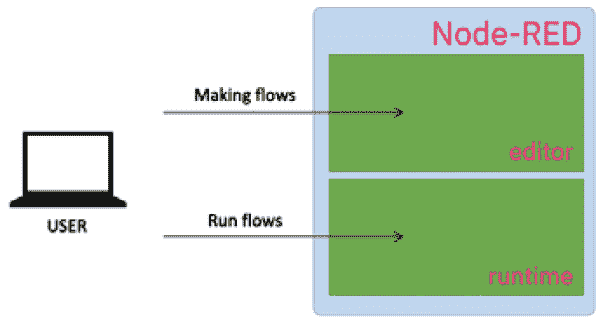

图 3.1 - Node-RED 概述

现在您已经理解了 Node-RED 的机制，让我们立即学习如何使用 Flow Editor。

### 使用流编辑器

让我们以为例，看看 Flow Editor 的主要功能。

流量编辑器的主要特点如下:

- **Node**节点：Node-RED 应用程序的核心构建块，代表功能明确的模块单元。
- **Flow**：由多个节点串联组成的序列，体现消息在应用程序中流经的步骤链。
- **The panel on the left is the palette** 左侧面板为工具箱：编辑器中可用的节点集合，用于构建应用程序。
- **Deploy button**部署按钮：编辑完成后点击此按钮部署应用程序。
- **Sidebar**侧边栏：用于显示各类功能的面板，例如处理参数设置、规范及调试器显示。
- **Sidebar tab**侧边栏标签页：包含各节点设置、标准输出、变更管理等功能。
- **Main menu**主菜单：支持流程删除、定义导入/导出、项目管理等操作。
这些功能在流编辑器的屏幕上排列如下:

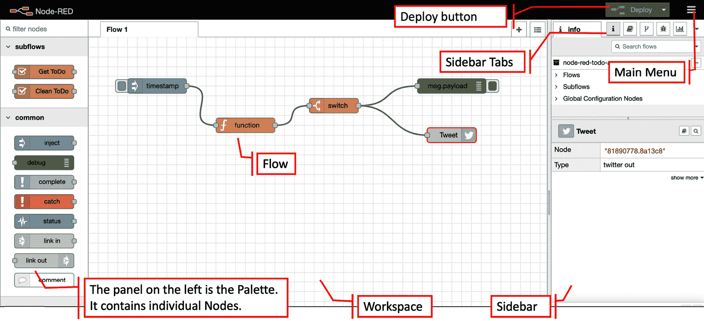

图 3.2 - Node-RED 流编辑器

在开始使用 Node-RED 之前，您需要了解 Flow 菜单中包含的内容。 其内容可能有所不同,这取决于 Node-RED 你使用的版本,但是有一些设置的项目,如 **Project management of flow**, **Arrange view**, **Import / export of flow**, **Installation of node published in library** 等等,都是普遍存在的。 有关如何使用 Node-RED 的更多信息，最好根据需要参考官方文档.

> 重要提示

> Node-RED 用户指南:[https://nodered.org/docs/user-guide/](https://nodered.org/docs/user-guide/)。

下图显示了 Node-RED 中的所有 Flow Editor 菜单选项:

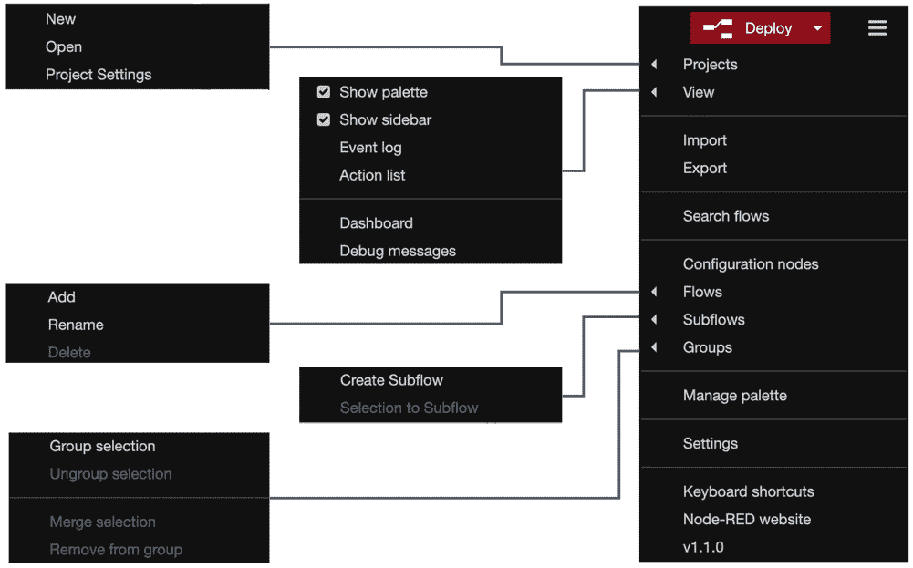

图 3.3 - Node-RED Flow Editor 菜单

这样，您就可以使用 Node-RED 构建应用了。 那么，让我们开始吧!

首先，您需要在您的环境中运行 Node-RED。 请参考 **[第二章](02.md#二搭建开发环境)**, *了解如何在您的环境（如Windows、Mac或树莓派）中进行配置（若尚未完成）*.

在Node-RED运行后，我们将进入下一章节，开始创建首个流程.

## 为数据处理应用制作流程

在这个部分中，您将创建一个工作的应用(在 Node-RED 中称为流)。 无论是**物联网**(**物联网**)还是作为 web 应用的服务器处理，Node-RED 执行的基本操作是依次传输数据。

在这里，我们将创建一个流，其中以伪方式生成 JSON 数据，数据最终通过 Node-RED 上的一些节点输出到标准输出。

在面板的左侧有许多节点。 请注意这里**common**类别。 你应该能够很容易地找到**inject**节点，如下图所示:

 **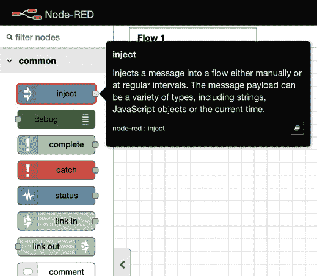

图 3.4 - Inject 节点

这个节点可以将消息注入到下一个节点。 让我们开始:

1.  Drag and drop it onto the palette of Flow 1 (the default flow tab).

    您将看到节点被标记为单词**timestamp**。 这是因为它的默认消息有效负载是一个时间戳值。 我们可以更改数据类型，所以让我们将其更改为 JSON 类型。

2.  Double-click the node and change its settings when the **Properties** panel of the node is opened:

    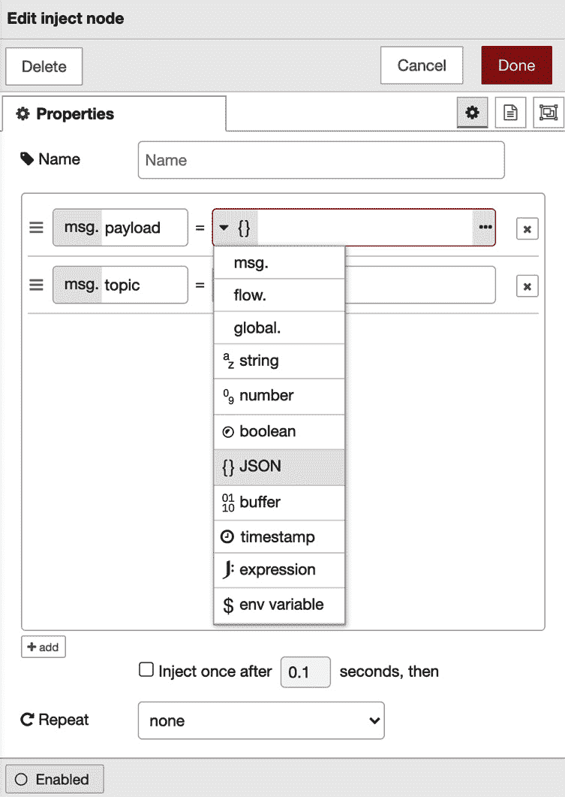

    图 3.5 -编辑注入节点属性面板

3.  单击第一个参数的下拉菜单，选择 **{}JSON**。 您可以通过单击右边的 **[…]** 按钮来编辑 JSON 数据。
4.  点击 **[…]** 按钮，JSON 编辑器将打开。 可以使用基于文本的编辑器或可视化编辑器生成 JSON 数据。
5.  This time, let's make JSON data with an item called **{"name" : "Taiji"}**. You should replace my name with your name:

    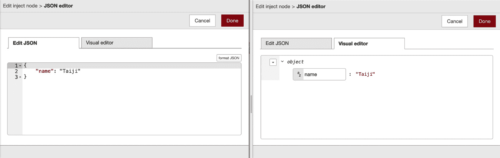

    图 3.6 - JSON 编辑器

    太好了——您已经成功地制作了一些示例 JSON 数据!

6.  点击**Done**按钮并关闭此面板。
7.  类似地，在调色板上放置一个**Debug**节点。
8.  After placing it, wire the **Inject** and **Debug** nodes to it.

    一旦执行此流，从**Inject**节点传递的 JSON 数据将由**debug**节点输出到调试控制台(标准输出)。 你不需要在**Debug**节点上配置任何东西:

    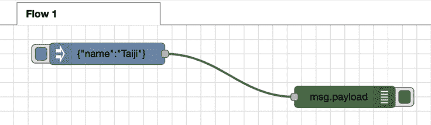

    图 3.7 -放置 Debug 节点并连接它

9.  最后，您需要部署您创建的流。 在 Node-RED Flow Editor 中，通过单击右上角的**deploy**按钮，我们可以将工作区上的所有流部署到 Node-RED 运行时.
    
10.  在运行流程之前，您应从节点菜单的侧边面板中选择**Debug**选项卡以启用调试控制台，如下图所示：

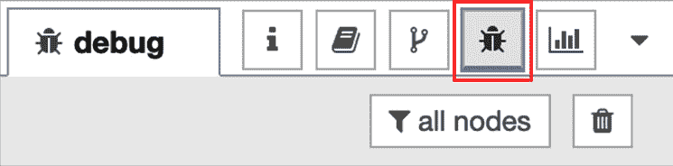

    图 3.8 -启用调试控制台

11.  让我们运行这个流程。 点击**Inject**节点的开关，查看调试控制台执行流的结果:

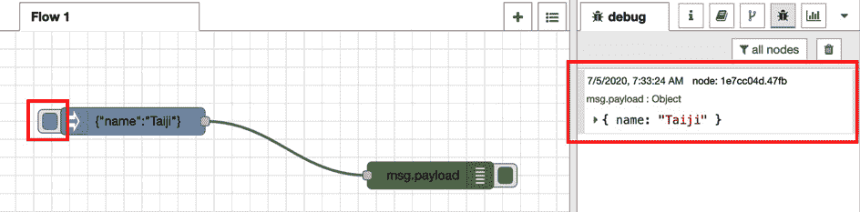

图 3.9 -执行流并检查结果

这是一个非常简单和容易处理数据流的示例。 在本书的后半部分，我们还将通过实际连接物联网设备并通过从 web API 获得的数据来实验数据处理。 在本节中，了解如何在 Node-RED 中处理数据就足够了。 接下来，我们将尝试为 web 应用创建流。

为 web 应用创建流程

在这个部分中，您将为一个 web 应用创建一个新的流。 我们将使用与前面创建数据处理流相同的方式创建这个流。

你可以在相同流程的工作空间中创建它(流程 1)，但是为了让事情更清楚和简单，让我们通过以下步骤为流程创建一个新的工作空间:

1.  从**Flow** 菜单中选择*Flows | Add**。Flow 2 将被添加到Flow 1 的右侧。这些流程名称（如“Flow 1”和“Flow 2”）是创建时默认提供的名称。若需更具体地命名流程，可随时进行重命名：

    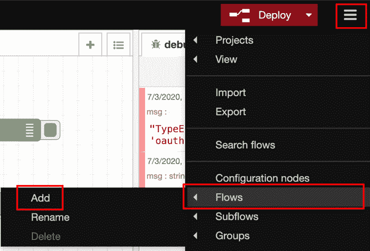

    图 3.10 -添加一个新的流

2.  从调色板的**network** 类别中选择**http in**节点，然后将其拖放至Flow 2的调色板上（即您刚添加的新流程标签页）：

    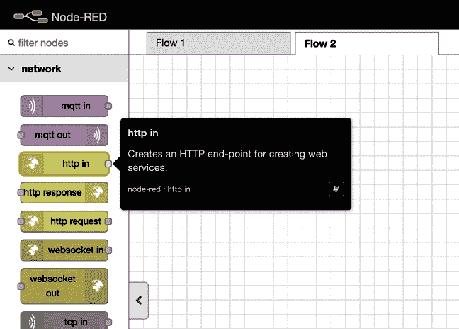

    图 3.11 -节点中的 http

3.  双击该节点打开其**Edit**对话框。
4.  Enter the URL (path) of the web application you will create.

    该路径将作为您将要创建的 web 应用的 URL 的一部分，位于 Node-RED URL 下。 在这种情况下，如果你的 Node-RED URL 是**http://localhost:1880/**，那么你的 web 应用 URL 将是**http://localhost:1880/web**。 下面的截图中可以看到一个例子:

    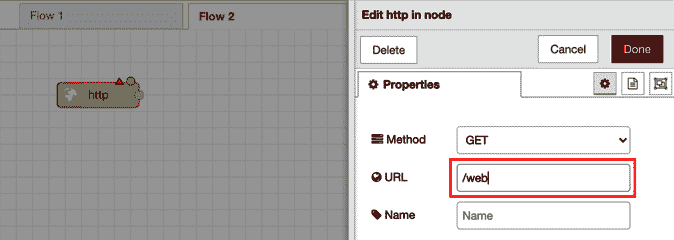

    图 3.12 -设置 URL 的路径

5.  要通过HTTP发送请求，需要一个HTTP响应。因此，请在Node-RED的工作区中放置一个**http response**节点。

    您可以在调色板的**网络**类别中找到该节点，该节点位于节点的**http in** 旁边。 这里，**httprespons响应** 节点简单地返回响应，因此您不需要打开配置面板。 你可以让它保持原样。 如果你想在响应消息中包含状态码，你可以在**设置settingS**面板中这样做，如下截图所示:

    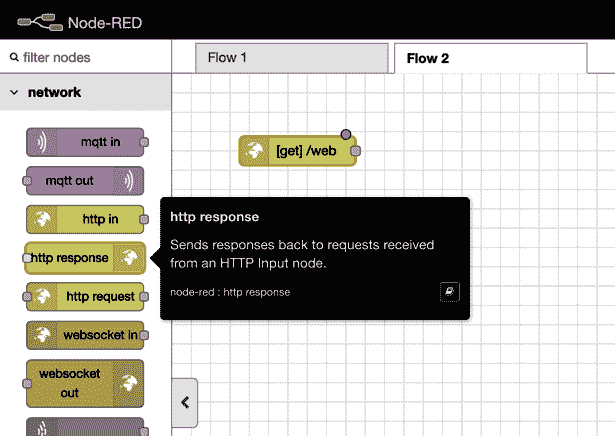

    图 3.13 - http 响应节点

6.  After placing an **http response** node on the palette, add a wire from the **http in** node to the **http response** node.

    这就完成了 web 应用的流程，因为我们已经允许 HTTP 请求和响应。 你会在每个节点的右上角看到一个浅蓝色的点，这表明它们还没有部署-所以请确保您点击**deploy**按钮:

    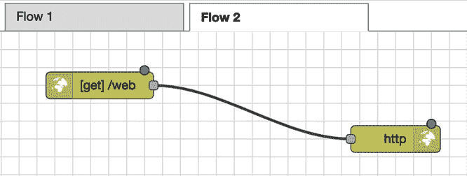

    图 3.14 -连线节点

7.  一旦成功部署，在浏览器中打开一个新标签。
8.  然后输入**http://localhost:1880/web**，访问节点部分**http 中显示的 web 应用的 URL。**

您应该发现屏幕上只显示 **{}**。 这不是一个错误。 它是发送 HTTP 请求并返回响应的结果。 现在，由于我们没有设置要传递给响应的内容，所以将一个空 JSON 作为消息数据传递。 这个看起来如下:

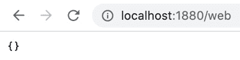

图 3.15 - Web 应用结果

这不是很好，所以让我们创建一些内容。 让我们做一些非常简单的事情，实现一些简单的 HTML 代码。 那么，我应该在哪里编码呢? 答案很简单。 node - red 有一个模板节点，它允许您指定 HTML 代码作为输出。 让我们用这个:

1. 将一个**template**节点拖拽到**http in**节点与**http response**节点之间的连接线上，使该**template**节点被连接在其中：

    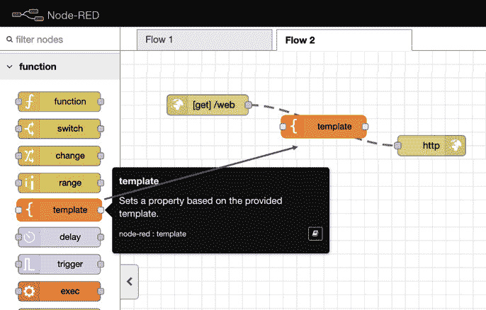

    图 3.16 -在两个现有节点之间的连线上放置一个“模板”节点

2.  接下来，双击**template**节点打开设置面板。您可以在**settings**面板的**Template** 区域进行编码。本次请使用以下示例HTML：标题需在头部指定。现在为正文添加页面标题，使用 < h1 > 标签。用 < h2 > 标签排版类似菜单的内容。代码效果如下：


```html
<html>
  <head>
    <title>Node-RED Web sample</title>
  </head>
  <body>
    <h1>Hello Node-RED!!</h1>
    <h2>Menu 1</h2>
    <p>It is Node-RED sample webpage.</p>
    <hr>
    <h2>Menu 2</h2>
    <p>It is Node-RED sample webpage.</p>
  </body>
</html>
```
    
> 请注意
> 
    你也可以从本书的 GitHub 存储库[https://github.com/PacktPublishing/-Practical-Node-RED-Programming/tree/master/Chapter03](https://github.com/PacktPublishing/-Practical-Node-RED-Programming/tree/master/Chapter03)获得这些代码。

3.  编辑完**template**节点后，请点击**Done**按钮将其关闭。

    下面的截图显示了你的模板节点在你编辑它时的样子:

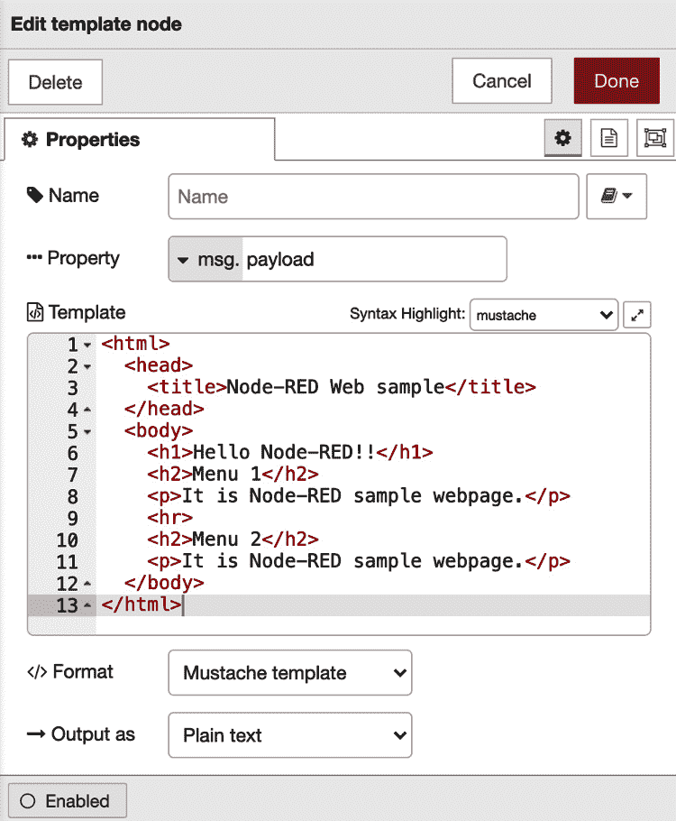

图 3.17 -模板区域中的代码

这样，我们就完成了准备在页面上显示的 HTML。 请确保您单击了**deploy**按钮。 再次进入**http://localhost:1880/web**页面。 您现在应该看到以下输出:

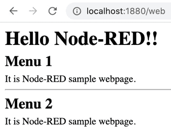

图 3.18 - Web 应用结果

此时，您应该了解如何在 Node-RED 上创建 web 应用。 我想，到目前为止，一切都很顺利。 现在我们已经建立了一些动力，让我们继续学习。 在下一节中，我们将导入和导出我们创建的流定义。

## 导入和导出流定义

在本节中，您将导入和导出您创建的流定义。 通常，在开发时，有必要备份源代码和版本控制。 您还可以导入其他人创建的源代码，或者导出自己的源代码并将其传递给其他人。 Node-RED 也有类似的概念。 在 node - red 中，通常的做法是导入和导出流本身，而不是导入或导出源代码(例如，前面描述的模板节点)。

那么，首先，让我们导出到目前为止创建的流。 这很容易做到:

1.  只需在Node-RED流程编辑器的**Main**菜单下，从**Edit**对话框中选择**Export**即可。

    显示“**Export**”菜单时，只能选择当前流或自己的所有流。 您还可以选择没有缩进的原始 JSON，或者有缩进的格式化 JSON。

2.  在这里，选择当前流并选择**Formatted**。
3.  现在，您可以选择如何保存导出的 JSON 数据——**Copy to clipboard** or **Download**.。这里我们需要下载 JSON 数据，因此请点击**Download**按钮：

    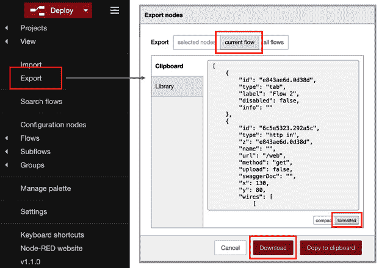

    图 3.19 -导出操作

    您将看到一个名为**flows.json**在您的机器的下载位置。

4.  在文本编辑器中打开该文件，以便您可以检查 JSON 文件的内容。

通过这些，我们已经学会了如何输出。

接下来，我们需要导入该定义(**flows.json**)放入 Node-RED 流编辑器中。 通过以下步骤做到这一点:

1.  Simply select **Import** from the **Flow** menu in the Node-RED Flow Editor.

    当出现**Import**菜单时，可以选择**Paste flow json**或**Select a file based import**选择文件。 您还可以从流量选项卡中选择**current flow**或**new flow**。 如果您选择**new flow**，将自动添加一个新的 flow 标签。
 
2.  在这里，请选择***Select a file based import**的文件并导入到**new flow**。 然后，选择名为**JSON file called flows**导出到本地机器。
   
3.  文件加载完成后，请点击**Import**按钮：

    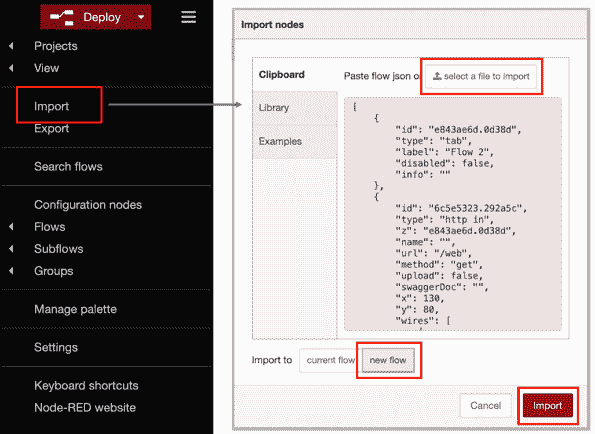

    图 3.20 -导入操作

4.  您现在在原有Flow 2标签页的同名流程旁，已生成名为Flow 2的新标签页。该流程已完整导入，但尚未部署，请点击**Deploy**按钮，如下所示：

    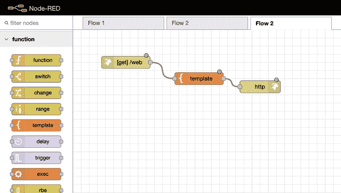

    图 3.21 -添加新流程

    这样，我们就成功地准备好了使用导入的流在我们的网页上显示的内容。 请确保单击**Deploy**部署按钮。

5.  通过 http://localhost:1880/web 再次访问网页。

在这里，你会看到这个网页的设计与你导出的网页相同。 伟大的工作!

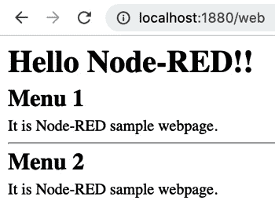

图 3.22 - web 应用的结果

现在，让我们结束这一章。

## 小结

在本章中，您学习了如何使用 Node-RED Flow Editor 制作基本流和导入/导出流。 现在您已经知道了如何使用 Node-RED Flow Editor，您将需要了解它的更多特性。 当然,Node-RED 并不只有基本节点 **Inject**,**http**,和**template**,但也更具吸引力的节点如。**switch**, **change**, **mqtt**, and **dashboard**. 在下一章中，我们将尝试使用几个主要节点，以便编写 JavaScript 代码、捕获错误、执行数据交换、延迟函数、使用 CSV 解析器等等。