# 六、云中实现的 Node-RED

在本章中，我们将学习如何利用 Node-RED，它可以在云平台(主要是平台即服务)上独立使用。 **平台即服务**(**PaaS)提供了一个实例,作为应用的执行环境,和执行应用创建的应用开发人员只关注自己不使用他们的权力来构建环境。 Node-RED 实际上是一个 Node.js 应用，所以你可以在任何有 Node.js 运行时环境的地方运行它。**

有各种主要的巨型云，如 Azure, AWS，和 GCP，但 Node-RED 是准备作为一个 Starter 应用(一个 web 应用，可以在 IBM 云上启动称为一个 Starter 应用)默认在 IBM 云，所以我们将在本章中使用它。

在本章中，我们将涵盖以下主题:

*   在云上运行 Node-RED
*   在云中使用 Node-RED 的具体情况是什么?
*   在服务器端进行物联网案例研究
*   制作样品流

在本章结束时，您将掌握如何构建一个流程来处理云上的传感器数据。

## 技术要求

本章将使用的代码可以在**第 06 章**文件夹中[https://github.com/PacktPublishing/-Practical-Node-RED-Programming](https://github.com/PacktPublishing/-Practical-Node-RED-Programming)找到。

## 在云上运行 Node-RED

这一次，我们将使用 IBM Cloud。 原因是 IBM Cloud 上有 Node-RED Starter Kit。 这是一种软件样板，其中包括云上 Node-RED 所需的服务，比如数据库、CI/CD 工具等等。

如果您还没有使用 IBM Cloud，不要担心——IBM 提供了一个免费的 IBM Cloud 帐户(Lite 帐户)，不需要信用卡注册。 您可以通过[http://ibm.biz/packt-nodered](http://ibm.biz/packt-nodered)注册一个 IBM Cloud Lite 帐户。

在 IBM Cloud 上使用 Node-RED 之前，您需要完成 IBM Cloud Lite 帐户的注册过程。

重要提示

在本书中，我们强烈建议您在使用 IBM Cloud 时选择一个 Lite 帐户。 你可以根据自己的意愿从精简版账户升级到标准账户(PAYG/Pay as You go)。 这意味着您可以通过注册信用卡自动升级到现收现付。

请注意，Lite 账户可以免费使用的服务可能会由现收现付支付。

现在，让我们按照以下步骤在 IBM Cloud 上启动 Node-RED:

重要提示

这里提供的说明/截图在写作时是正确的。 IBM Cloud 的 UI 更改如此频繁，以至于它可能与当前的 UI 不同。

1.  Log in to IBM Cloud ([https://cloud.ibm.com](https://cloud.ibm.com)) with the account you created previously:

    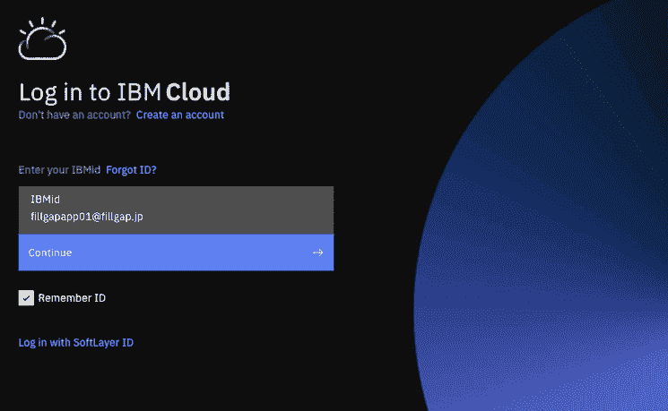

    图 6.1 -通过 Lite 帐户登录

2.  After logging into IBM Cloud, you will see your own dashboard on your screen. If this is your first time using IBM Cloud, no resources will be shown on the dashboard:

    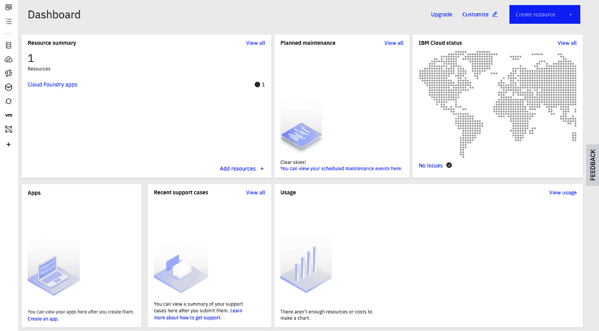

    图 6.2 - IBM 云仪表板

    接下来，我们将在这个云平台上创建 Node-RED。

3.  We will create Node-RED as a service on this cloud. Click **App Development** from the menu at the top left and click the **Get a Starter Kit** button. This lets you create a new application service:

    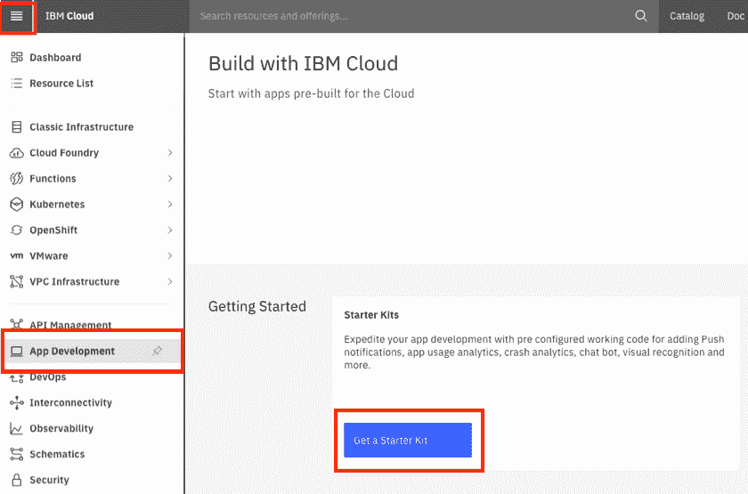

    图 6.3 -获取 Starter Kit 按钮

4.  You can find Node-RED if you type **Node-RED** into the search text box. Once you've found it, click on the **Node-RED** panel:

    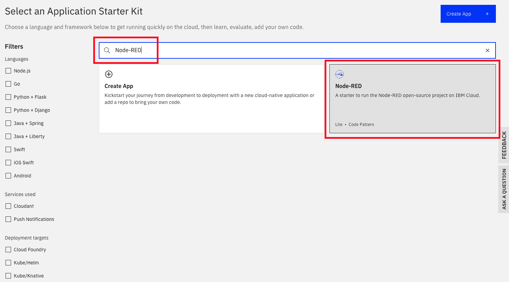

    图 6.4 - Node-RED Starter Kit

5.  After clicking on the **Node-RED** panel, we need to set some items.

    您可以通过提供自己的值来自由更改每一项，但在本章中，这里设置的值将用于解释目的。

    要配置的设置和值请参见图 6.5。 请注意，这些项一旦设置，以后就不能更改。

6.  After setting all the items, click the **Create** button:

    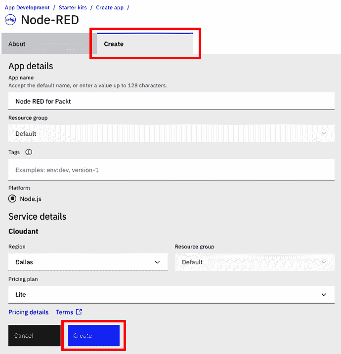

    图 6.5 -创建 Node-RED 作为 Node.js 应用

    您现在已经为组成 Node-RED 的应用创建了框架。 在此之后，您将被自动重定向到**App Details**屏幕，在那里您将能够看到链接服务的**Cloudant**实例也已经准备好了。

    但是，只创建了应用源代码和合作服务实例，它们还没有部署到 IBM Cloud 上的 Node.js 执行环境中。 实际的部署将在启用 CI/CD 工具链时完成。

7.  When everything is ready, click on the **Deploy your app** button in the center of the screen to enable it:

    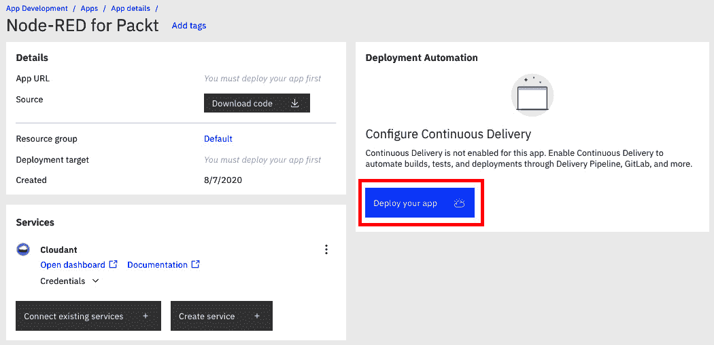

    图 6.6 -部署 Node-RED 应用

8.  单击**部署应用**按钮后，移动到应用设置窗口。
9.  系统会要求你创建一个 IBM Cloud API 密钥。不用担心，密钥会自动生成。点击 **New（新建）** 按钮打开新的弹窗，然后在弹窗中点击 **OK（确定）** 按钮。完成此操作后，系统将自动生成 IBM Cloud API 密钥。

    IBM 云 API 密钥

    IBM Cloud API Key 用于控制您的 IBM Cloud 帐户和各种服务(例如，本教程中的 Cloud Foundry)。 例如，您可以使用它来发出令牌，以便外部访问 IBM Cloud 上的服务。 您可以在这里找到更多关于 IBM 云 API 密钥:[https://cloud.ibm.com/docs/account?topic=account-manapikey](https://cloud.ibm.com/docs/account?topic=account-manapikey)。

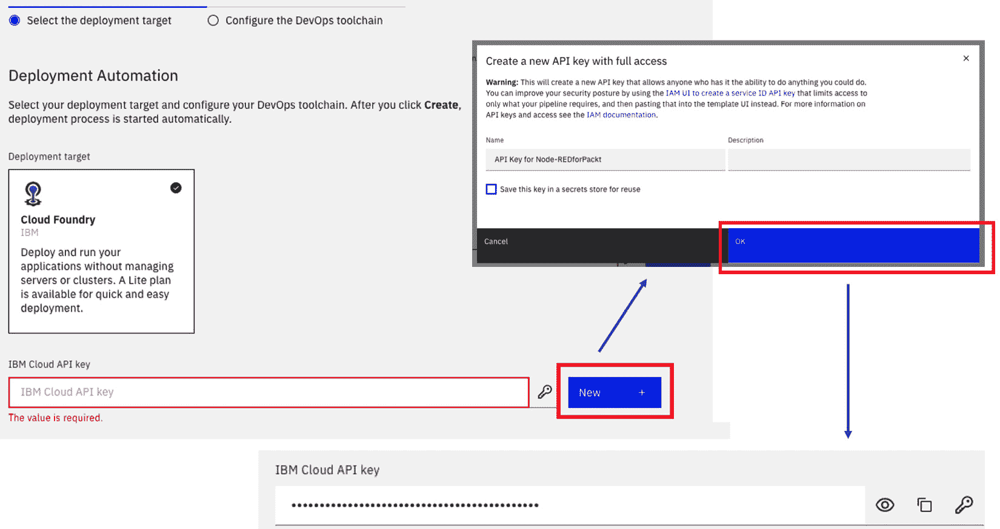

    图 6.7 -生成 IBM 云 API 密钥

10.  Select the resource spec on the window.

这一次，我们使用带有 Lite 帐户的 IBM Cloud，因此我们只有 256 MB 的内存用于 IBM Cloud 上的所有服务。 因此，如果我们为 Cloud Foundry Node.js 服务使用 256mb 的内存，我们将不能为其他服务使用更多的内存。 但是 Node-RED 需要 256mb 才能在 IBM Cloud 上运行，所以请在这里使用 256mb。 默认情况下，它已经为实例分配了 256 MB，因此单击**Next**按钮，不改变参数:

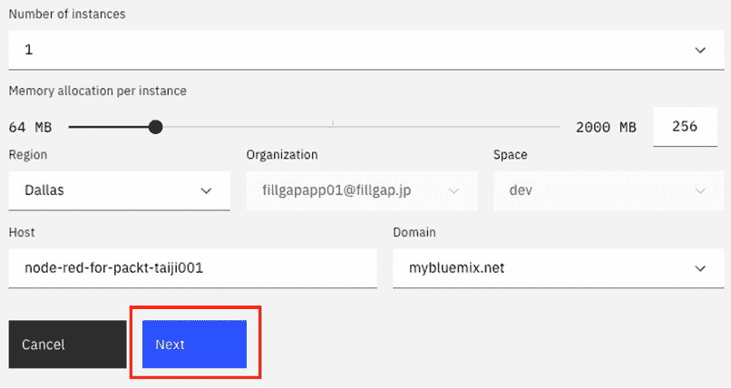

    图 6.8 - Node.js 运行时实例细节

完成此操作后，将显示一个**DevOps 工具链**设置屏幕。

11.  Click the **Create** button, with the default values filled in.

您可以将 DevOps 工具链名称更改为任何您喜欢的名称。 这是您在 IBM Cloud 中创建的工具链的名称:

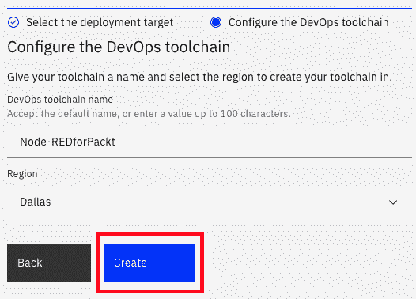

    图 6.9 -配置 DevOps 工具链窗口

现在，您已经准备好使用环境(Node.js 运行时和 DevOps 工具链)来运行您在上一步中创建的 Node-RED 应用。 您创建的 Node-RED 应用会通过工具链自动部署到 Node.js 运行时中。

12.  确认**交付流水线（Delivery Pipelines）**（DevOps 工具链中用于执行各工具的流水线）区域中显示的**状态（Status）**为**成功（Success）**，然后点击其上方的工具链名称（本例中为 **Node-REDforPackt**）：

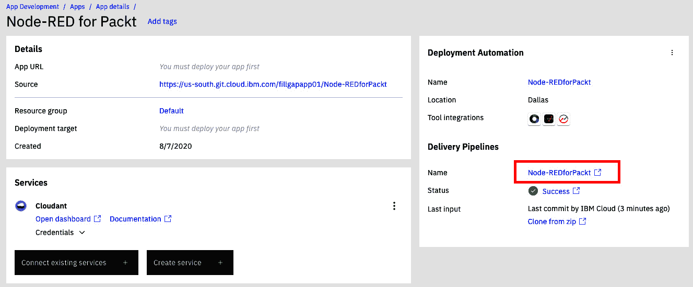

    图 6.10 -检查 Node-RED 状态并移至 Pipeline 工具

在**交付流水线（Delivery Pipelines）**中，检查 **BUILD（构建）** 和 **DEPLOY（部署）** 面板的状态是否均为**绿色**，并显示 **STAGE PASSED（阶段已通过）**。

13.  Click on **View console** under **LAST EXECUTION RESULT** on the **DEPLOY** panel:

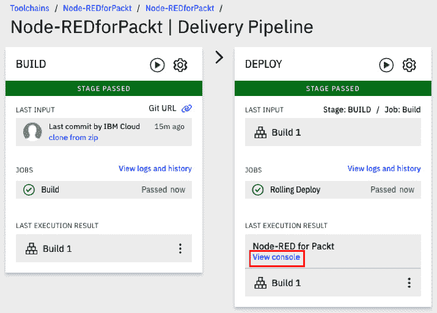

    图 6.11 -检查各阶段状态并移动到 App Console

14.  在 Node-RED 应用的控制台界面中，确认状态为**正在运行（Running）**，然后点击**查看应用地址（View App URL）**。

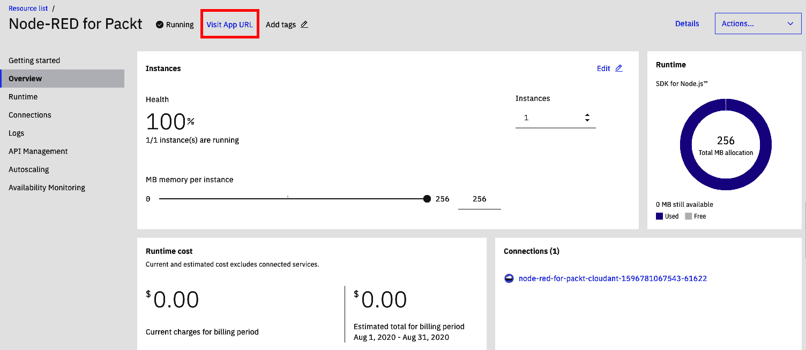

    图 6.12 -检查 Node-RED 正在运行并打开 Flow Editor

伟大的工作! 您在 IBM Cloud 上打开了 Node-RED 流编辑器。 接下来，我们将开始使用您刚刚打开的 Node-RED 流编辑器。

如果你在执行这些步骤时出现了任何错误，最好是删除 Cloud Foundry App, Cloudant，和 DevOps 工具链，并按照前面提到的相同步骤重新创建它们。

15.  Set up a **Username** and **Password** to access your flow editor on IBM Cloud.

单击**Visit App URL**后，您将被重定向到初始设置对话框，以便您可以在 IBM Cloud 上使用 Node-RED 流编辑器。

您可以通过单击该对话框进行每个**按钮,但请注意,你应该选择**安全编辑所以只有授权用户可以访问它**与**用户名**和**密码以登录到自己的流编辑器。 这是因为这个流编辑器在 IBM Cloud 上是一个公共 web 应用。 这意味着，如果 URL 已知，任何人都可以访问您的流编辑器。 所以，我强烈建议您选择这个选项，并设置您的自己的**用户名**和**密码**值:

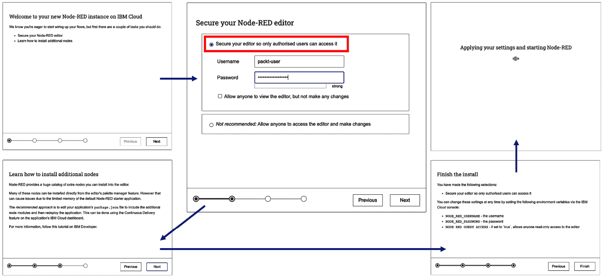

图 6.13 -设置访问流编辑器的用户名和密码

**我们几乎完成了!**

点击 **Go to your Node-RED flow editor** 按钮，然后使用你在上一步中设置的 **Username** 和 **Password** 进行登录：

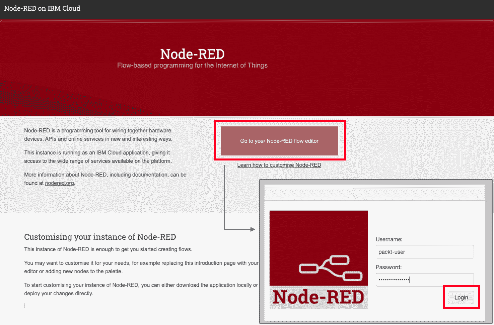

    图 6.14 -登录到 Node-RED 流编辑器

接下来，我们将检查 IBMCloud 上的 Node-RED 流编辑器，看看它是否可用。

点击**inject**节点，查看结果:

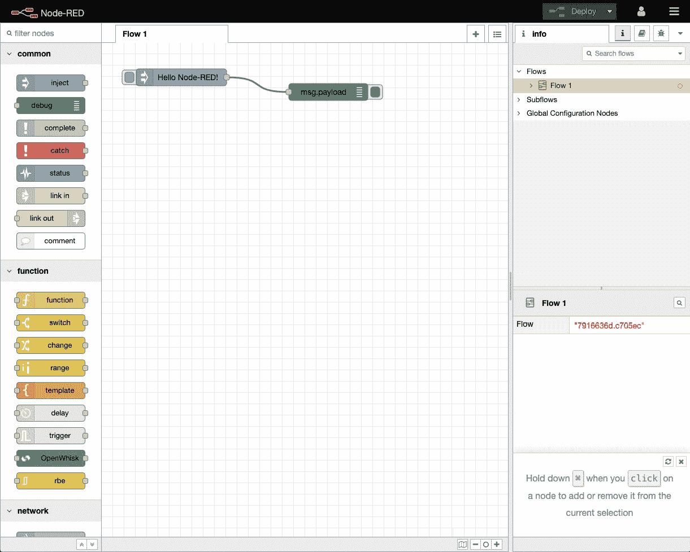

图 6.15 -默认示例流程

当您单击**inject**节点时，您将在**debug**选项卡上看到结果值:

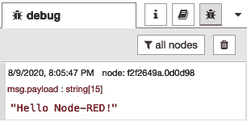

图 6.16 -检查结果

现在，您可以在 IBM Cloud 上的 Node-RED 中创建流。 Node-RED 流编辑器总是作为 Node.js 应用在 IBM 云上运行。 这意味着 Node.js 运行时服务(实例)在 IBM Cloud 上是启用的。 换句话说，与运行在树莓派上的 Node-RED 不同，这个版本的 Node-RED 通过互联网访问流编辑器。

在下一节中，我将简要说明在这种云上使用 Node-RED 的情况。

## 在云中使用 Node-RED 的具体情况是什么?

让我们重温一下在云中使用 Node-RED 的情形。

正如我们在前一章中提到的，Node-RED 既是一个工具，也是一个执行环境，用于创建用 Node.js 编写的 Node.js 应用。 作为使用 Node-RED 构建应用的原因之一，我解释说，通过对单个数据处理单元进行黑盒，每个进程的作用变得非常清楚，并且易于构建和维护。

这不仅在边缘设备上是相同的原因，在服务器端(云端)也是一样的原因，用于持久化、分析和可视化边缘设备收集的数据。

Node-RED 最大的特点是它以顺序的方式或以消息的形式并行地处理 Node.js。 可以说，这非常适合物联网数据处理。

再次，正如我们在前一章中讨论的，物联网解决方案的标准架构是建立在边缘设备和云平台上的。 它将边缘设备获取的传感器数据发送到云，使其持久，并将其处理到所需的处理链。

本章将聚焦于云的这一部分。

边缘设备和云还没有真正连接起来。 假设数据已经传递到云中，让我们将数据持久化并可视化。

我们将使用 IBM Cloud 上 node - red 的所有开发人员都很喜欢的仪表板节点。

在 IBM Cloud 上使用 node - red 之前，请安装一个新节点; 即**node-red-dashboard**。

Node-RED 提供了**调色板管理器**，该调色板管理器易于安装，并用于直接安装额外的节点。 当您使用大量节点时，这非常有用。 但是，由于 IBM Cloud Lite 帐户的 Node-RED 应用的内存有限，可能会出现问题。

因此，在这里，我们需要获得**node-red-dashboard**节点，以便编辑应用的**包。 json**文件，并在 IBM 云上重新部署 Node-RED 应用。

您可以在[https://flows.nodered.org/node/node-red-dashboard](https://flows.nodered.org/node/node-red-dashboard)上了解该节点。

按照以下步骤对**包进行更改。 json**文件:

1.  在 IBM Cloud 的 Node-RED **应用详情（App details）** 页面，点击 **源代码（source）**。
这会将你重定向到一个 Git 仓库，你可以在其中编辑 Node-RED 应用的源代码。

    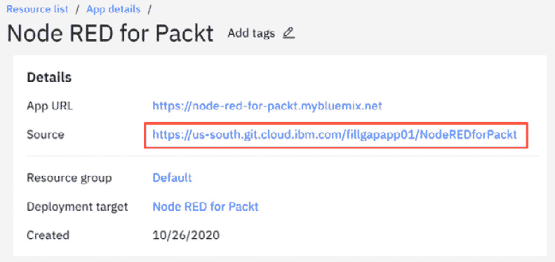

    图 6.17 -访问应用源

2.  点击文件列表中的 package.json 文件。该文件用于定义你的应用程序的模块依赖关系：

    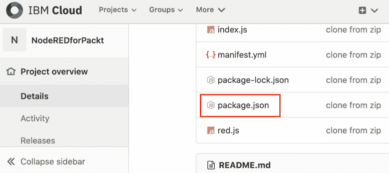

    图 6.18 -选择 package.json

3.  点击 编辑（Edit） 按钮，并在 依赖项（dependencies） 部分添加以下条目：

    “node-red-dashboard”:“2.倍”,

4.  添加任何提交消息，并点击**提交更改**按钮:

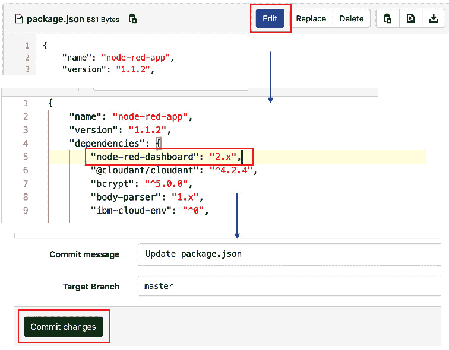

图 6.19 -编辑包。 Json，并添加 node-red-dashboard

之后，连续交付管道将自动开始构建和部署 Node-RED 应用。 你可以在任何时候检查交付管道的状态，就像你在创建 Node-RED Starter App 时所做的那样:

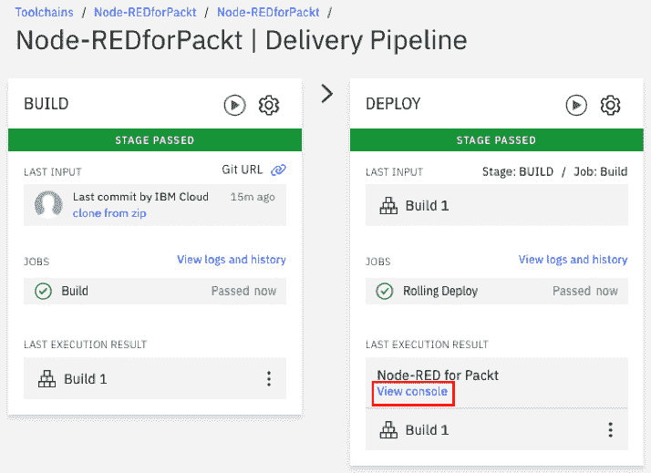

图 6.20 -自动重建和重新部署应用

当您遇到 **Deploy Stage 部署阶段** 由于 lite 帐户的内存限制错误而失败时，请在 IBM Cloud 仪表板上停止 Node-RED 服务，然后运行**Deploy Stage 部署阶段**。 你可以通过访问你的 IBM 云仪表板，点击**Cloud Foundry apps**下**Resource summary**来停止你的 Node-RED 服务:

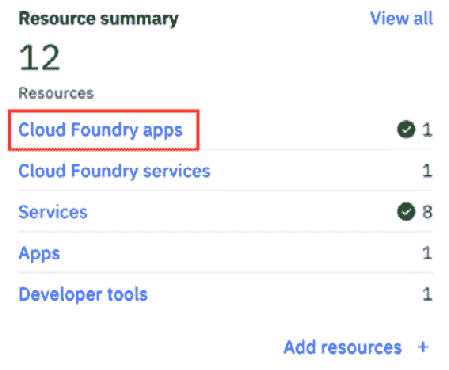

图 6.21 选择 Cloud Foundry 应用

然后，点击 **Cloud Foundry apps** 下 Node-RED 记录上的 **stop** 选项。

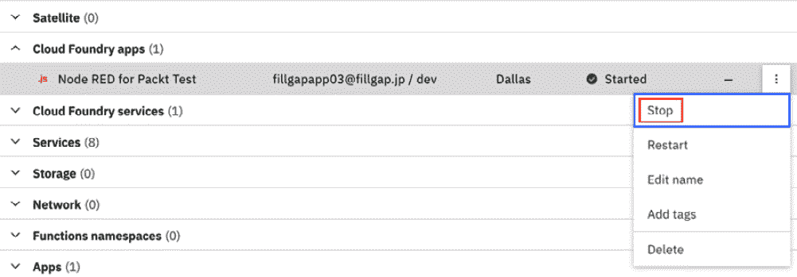

图 6.22 单击 Stop 选项

这是所有。 您可以通过关闭**面板管理**屏幕并向下滚动流编辑器的左侧，确认仪表板节点已被添加，如下图所示:

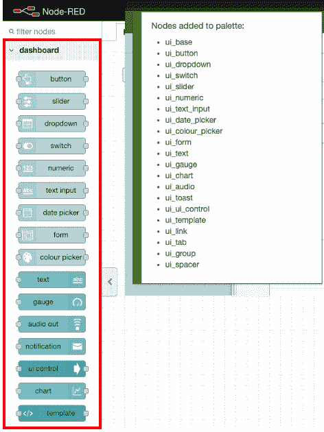

图 6.23 -检查仪表板节点是否已安装

还有一件事:我们需要使用一个数据库，但 IBMCloud 的 Node-RED 版本默认有一个 Cloudant 数据库。 在下一节中，我们将使用 Cloudant 作为案例研究。

现在，您可以在 IBM Cloud 上使用 Node-RED 用于物联网服务器端情况。

## 物联网案例研究点在服务器端

现在，让我们将作为物联网的服务器端案例研究。

它不依赖于每个边缘设备的情况。 它主要用于处理数据并将其存储在数据库中以实现可视化。

在本章中，我们将考虑物联网的用例; 也就是说，假设使用传感器模块接收的传感器数据是在服务器端接收的，以及后续的处理部分。

与前一章的不同之处在于，在本服务器端处理教程中，数据的内容没有多大意义。 主要目的是保存接收到的数据并根据需要将其可视化，因此我想定义以下两个用例。

### 用例 1 -存储数据

第一种情况是存储数据。 让我们创建一个应用(流)来存储从设备接收到的数据。 在本节中，我们不使用来自设备的真实数据; 我们只使用由 inject 节点生成的数据:

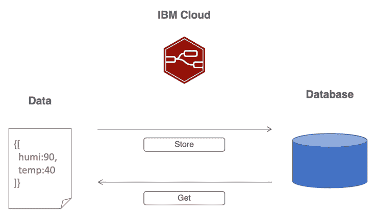

图 6.24 -用例 1 概述

现在，让我们看看第二个用例。

### 用例 2 -温湿度传感器

第二种情况是用图形或图表来显示数据。 让我们创建一个应用(流)，在仪表板上发布从设备接收的数据。 我们不会使用来自任何设备的真实数据，只使用由 inject 节点生成的数据:

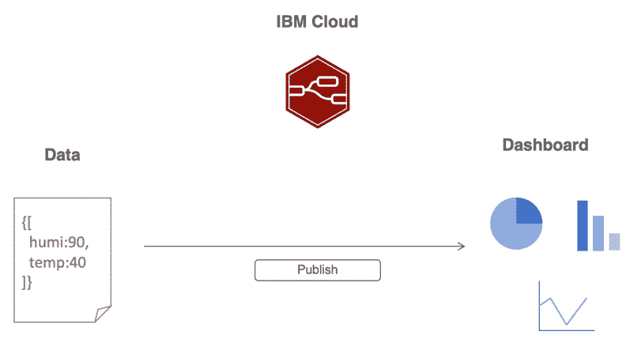

图 6.25 -用例 2 概述

正如前面提到的，我们将在案例 1 中使用 Cloudant 作为数据库，在案例 2 中使用仪表板作为图形显示。 这些已经准备好了。

## 制作样品流

现在，让我们在 Node-RED 流编辑器上创建这两个服务器端案例流。

请再次检查 **Cloudant** 节点和 **Dashboard** 节点是否已经安装在您的流程编辑器上。 如果您没有这些节点，请按照*中提到的步骤安装这些节点。在云上使用 Node-RED 的具体情况是什么?* 本章的章节。

现在，您需要为本教程在 **Cloudant** 上准备一个特定的数据库。 遵循以下步骤:

1.  访问你的 IBM Cloud 控制台，并在**资源摘要（Resource summary）**区域中点击**查看全部（View all）**。

    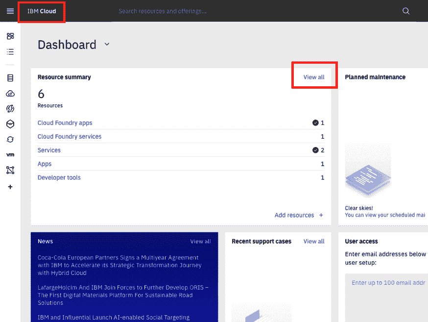

    图 6.26 - IBM Cloud 仪表板视图

2.  你会找到通过 Node‑RED 创建的 **Cloudant** 服务，请点击该服务的名称：

    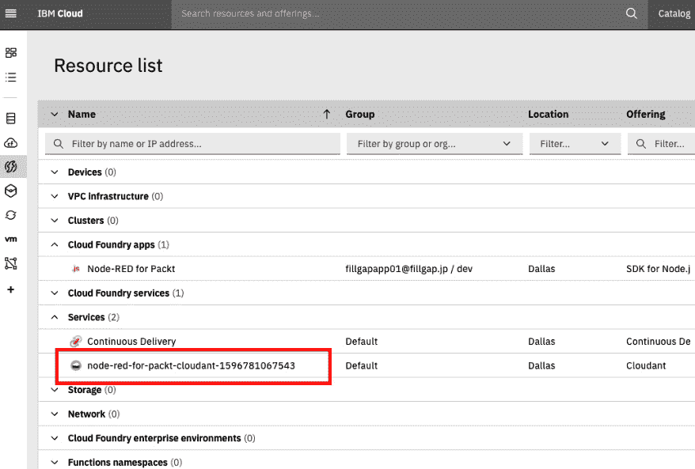

    图 6.27 -从资源列表中选择 Cloudant 服务

3.  在 IBM Cloud 左上角，点击 **启动控制面板（Launch Dashboard）** 按钮。


    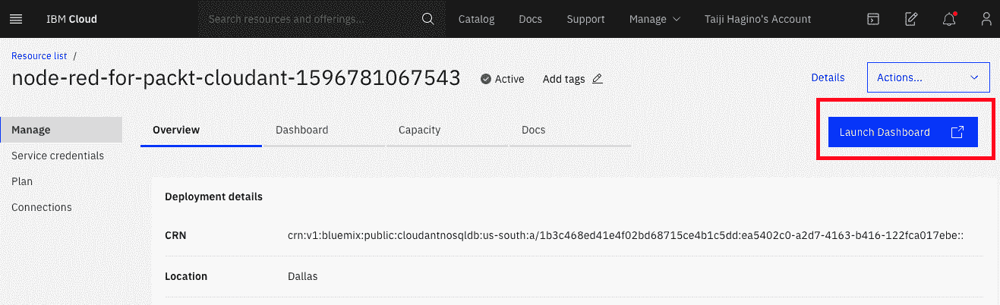

    图 6.28 -启动 Cloudant 仪表板

4.  在启动 Cloudant 仪表板后，请单击**创建数据库**并为您的数据库输入一个名称。 你想给它起什么名字都行; 这里，我们使用了**packt_db**。 然后，点击**Create**按钮:

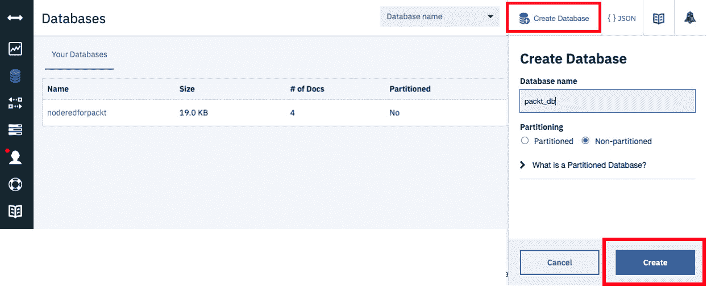

图 6.29 -在 Cloudant 创建一个新的数据库

现在您已经为本教程创建了数据库，您可以在任何时候使用它!

### 为用例 1 创建一个流——存储数据

在物联网中，服务器端处理从从边缘设备接收到的点开始。 然而，正如我们前面提到的，我们将重点放在将数据存储在数据库中，因此我们将使用由**注入**节点生成的虚拟数据。 作为消息接收的数据块被持久化到 Node-RED 上的 Cloudant 数据库中。

我们可以通过以下步骤创建流:

1.  从左侧面板中拖入一个 **inject 节点** 和一个 **cloudant out 节点** 到流程编辑器的工作区中：

    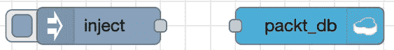

    图 6.30 -放置 Inject 节点和 cloudant out 节点

    注入节点生成虚拟数据，而**云输出**节点将输入值按原样存储在 cloudant 数据库中。

2. 在那之后，我们还会创建一个从 Cloudant 读取数据的流程，但现在先创建用于保存数据的流程。将这些节点连接起来：
    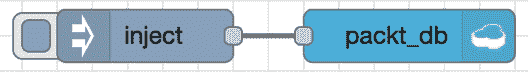

    图 6.31 -连接这两个节点

3.  接下来，修改**inject**节点的设置。 双击该节点，打开**设置**面板。
4.  为第一个参数选择 **JSON** 格式，也就是 **msg.payload**，然后点击右侧的 **[…]** 按钮打开 JSON 编辑器：

    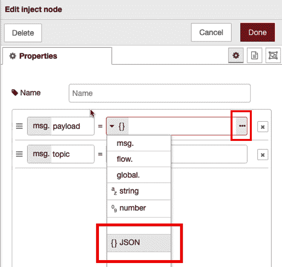

    图 6.32 - JSON 对注入节点的第一个参数

    这里可以使用两种类型的编辑器; 也就是说，文本编辑器或可视化编辑器。 你可以添加任何值到 JSON 风格，但这里是我们使用的 JSON 数据:

```js
    {"temp":"29.18", "humi":"55.72"}
```

    您可以使用选项卡在文本编辑器和可视化编辑器之间切换。 请参考以下图片:

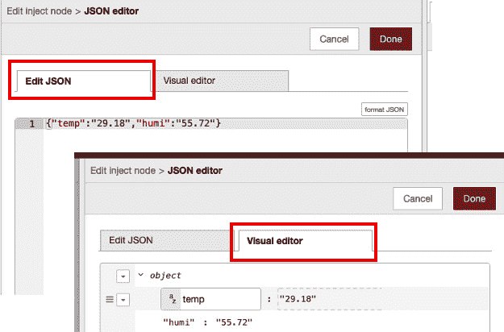

    图 6.33 -有两种类型的 JSON 编辑器可用

    没有需要编辑**msg。 主题**。

5.  设置完 **JSON** 数据后，点击右上角的 **Done** 按钮关闭 **设置** 面板。
6.  然后，编辑 **cloudant out 节点** 的设置。操作很简单：只需输入 **packt_db** 作为数据库名称。该名称就是你在 Cloudant 控制面板中设置的数据库名。

    第一个参数 **Service服务** 自动设置; 它是您在 IBM Cloud 上的 Cloudant 服务。 第三个参数**操作**不需要更改其默认值。

7.  设置好数据库名称后，点击右上角的 **Done（完成）** 按钮关闭 **Settings（设置）** 面板。

    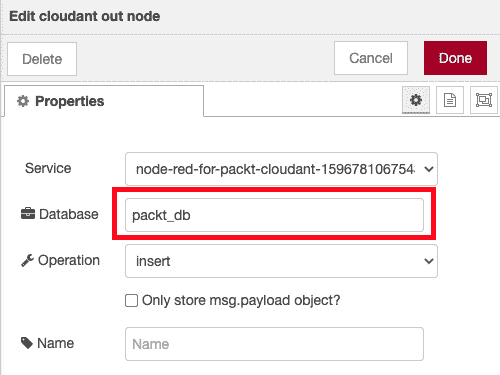

    图 6.34 -在云计算出节点上设置数据库名称

8.  就是这样! 不要忘记点击**deploy**按钮。
9.  单击**inject**节点上的按钮来运行流。 单击按钮后，数据将存储在 Cloudant 数据库中。

此时，我们无法通过 Node-RED 流编辑器检查 Cloudant 上的数据; 我们只能在 Cloudant 仪表板上检查:

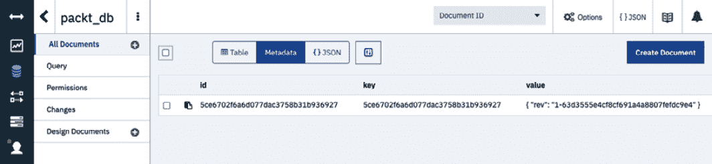

图 6.35 - cloud dashboard 上的结果

现在，让我们按照以下步骤创建一个从 Cloudant 获取数据的流:

1.  从流程编辑器左侧的面板中，将 **inject 节点**、**cloudant in 节点**和 **debug 节点**拖放到上一个流程所在的工作区中。

    **inject**节点只是作为触发器执行这个流，因此不需要更改其中的参数。 节点中的**cloudant 从 clouddant 数据库获取数据。 **debug**节点在调试选项卡上输出日志。**

2.  将这些节点连接起来：

    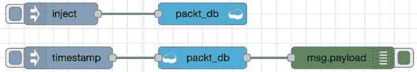

    图 6.36 -放置新的三个节点并连接它们以获取数据

3.  接下来，通过双击节点打开其**设置**面板，修改节点中的**云的设置。**
4.  和 **cloudant out** 节点一样，输入 **packt_db** 作为数据库名称，并在第三个参数（即**搜索依据Search by**）中选择**所有文档（all documents）**。

    第一个参数**Service服务**自动设置; 它是您在 IBM Cloud 上的 Cloudant 服务。

5.  设置好数据库名称和搜索目标后，点击右上角的 **完成（Done）** 按钮关闭 **设置（Settings）** 面板：

    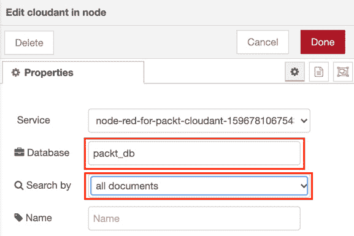

    图 6.37 -设置数据库名称并在节点中搜索 cloudant 上的目标

6.  就是这样! 不要忘记点击**deploy**按钮。
7.  点击 **inject** 节点上的按钮运行该流程。执行此操作后，你将从 Cloudant 数据库中获取数据。

    您将看到结果输出到**debug**窗口:

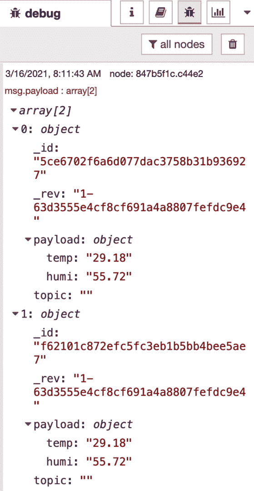

图 6.38 -从 Cloudant 获取数据的结果

恭喜你! 这样，我们就成功地创建了一个基本流程(应用)，使用 Node-RED 将传感器数据存储在数据库中。

[https://github.com/PacktPublishing/-Practical-Node-RED-Programming/blob/master/Chapter06/cloudant-flows.json](https://github.com/PacktPublishing/-Practical-Node-RED-Programming/blob/master/Chapter06/cloudant-flows.json)

> 重要提示: 此流在云入/出流中没有云服务名称的值。 导入此流定义后，请检查您的服务名称是否已自动设置。

现在您了解了如何处理 Node-RED 上的数据。 我们将在下一节中可视化该数据。

### 为用例 2 制作流程——可视化数据

第一个用例用于在数据库中存储传感器数据，而第二个用例用于在 Node-RED 上可视化传感器数据。 在物联网中，在获取传感器数据后，我们必须将其以某种形式可视化。 这里的重点是检索和可视化存储在用例 1 中的数据。 我们将遵循以下步骤:

1.  从流程编辑器左侧的面板中，将 **inject 节点**、**function 节点**和 **chart 节点**拖放到工作区中。然后，将这些节点连接起来：

    

    图 6.39 -放置节点并连接它们以显示数据

    **Inject**节点只是作为触发器执行这个流，因此不需要更改其中的参数。 **function**节点生成数字数据，以图表形式显示在 node - red 上。 最后，通过 **chart** 节点，可以将数据显示在图表中。

2. 代码在**function**节点中生成数字数据，可传递给图表节点。

3. 双击该节点以打开设置面板。然后，将以下代码添加到你所放置的 **function（函数）**节点中:

```js
    // Set min and max for random number
var min = -10 ;
var max = 10 ;
// Generate random number and return it
msg.payload = Math.floor( Math.random() * (max + 1 - min) 
) + min ;
return msg;
```

它看起来是这样的:

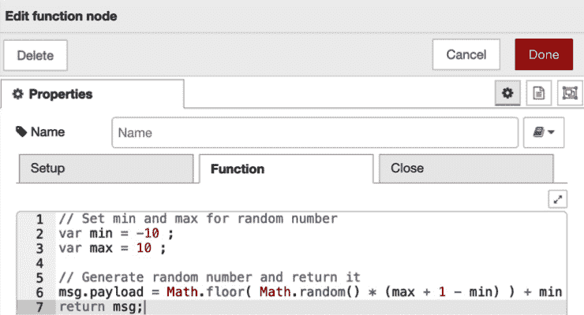

    图 6.40 -产生随机数的代码


4. 然后，编辑 **chart 节点** 的设置。

5. 设置面板打开后，点击 **Group** 参数右侧的铅笔图标按钮。这时会打开仪表板分组设置界面，你可以使用默认名称，不过我们这里将其命名为 **Packt Chart**。

6. 输入名称后，点击右上角的 **添加（Add）** 按钮，返回 **chart 节点** 的设置面板；确保 **组（Group）** 参数为 **Packt Chart**。现在，点击右上角的 **完成（Done）** 按钮：

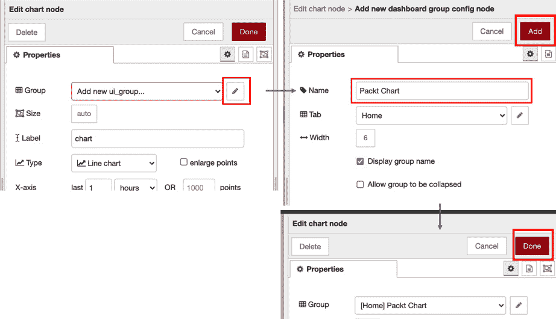

    图 6.41 -在图表节点上设置参数

7. 完成！别忘了点击 **部署Deploy** 按钮。
8. 点击 **inject** 节点左侧的按钮运行流程。点击按钮后，**function** 节点生成的数据会发送到 **chart** 节点。
你可以在仪表板窗口中查看结果。

9. 点击流程编辑器右上角的 **仪表板(Dashboard)** 按钮，再点击 **打开窗口(Open window)** 按钮。
这两个按钮是图标形式，请参考下面的截图确认需要点击的按钮。

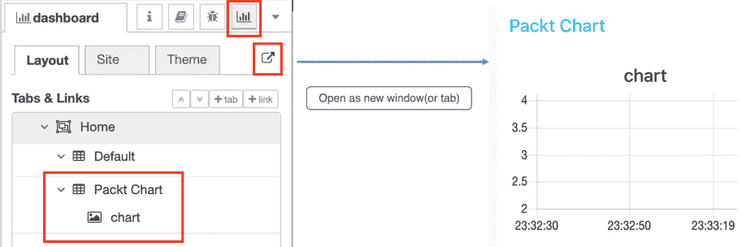

    图 6.42 -单击仪表板图标按钮并打开窗口图标按钮

10. 折线图在新窗口中将为空。 请点击 **inject注入** 节点的开关几次。 然后，你会看到折线图中填充的值:

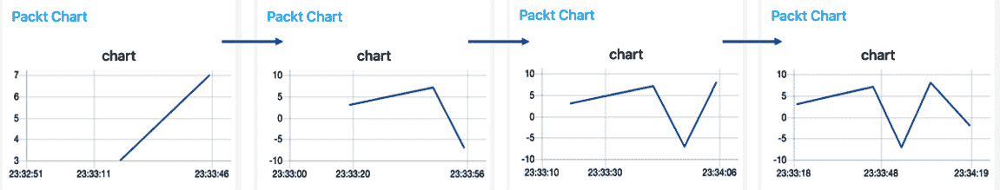

图 6.43 -带值的折线图

恭喜你! 这样，我们就成功地创建了一个基本流程(应用)，它使用 Node-RED 将传感器数据显示为图表。

您也可以在这里下载此流定义文件:[https://github.com/PacktPublishing/-Practical-Node-RED-Programming/blob/master/Chapter06/dashboard-flows.json](https://github.com/PacktPublishing/-Practical-Node-RED-Programming/blob/master/Chapter06/dashboard-flows.json)。

## 小结

在本章中，您学习了如何通过一个真实的物联网用例创建一个服务器端示例流(应用)。 这些都是简单的教程，但我相信它将有助于您了解如何为物联网服务器端应用制作流。

我们在这里创建的流程步骤将帮助您在将来为其他服务器端应用创建不同的流程。

在下一章中，我们将使用与本章相同的物联网用例，但我们将创建一个调用 web API 的实际示例流(应用)。