# 十二、利用 Slack 和 IBM Watson 开发聊天机器人应用

在本章中，我们将使用 Node-RED 创建一个聊天机器人应用。 对于聊天机器人应用的 UI，我们将使用 Slack，我们将使用 IBM Watson AI 的技能。 在完成本章的教程后，您将学习如何将 Node-RED 与外部 API 结合起来创建应用。 这将帮助您在未来使用 Node-RED 创建可扩展的 web 应用。

让我们从以下几个话题开始:

* 创建一个 Slack 工作区
* 创建沃森助理 API
* 启用从 Node-RED 到 Slack 的连接
* 构建聊天机器人应用

在本章结束时，您将掌握如何使用 Node-RED 制作一个 Slack 聊天机器人应用。

## 技术要求

要在本章取得进展，你需要具备以下条件:

* IBM Cloud 帐号:[https://cloud.ibm.com/](https://cloud.ibm.com/)。
* 本章使用的代码可在**第 12 章**文件夹[https://github.com/PacktPublishing/-Practical-Node-RED-Programming](https://github.com/PacktPublishing/-Practical-Node-RED-Programming)中找到。

## 创建一个 Slack 工作区

本教程使用**Slack**作为聊天机器人应用的 UI。 Node-RED 负责控制聊天机器人应用后台的消息交换。

该聊天机器人应用的整体视图如下:

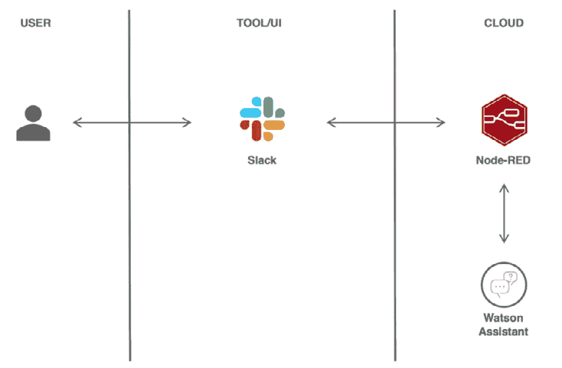

图 12.1 -应用概述

首先，按照以下步骤创建一个 Slack 工作空间，以便在此应用中使用。 如果你已经有一个 Slack 工作区，你可以使用现有的。 在这种情况下，跳过下面的步骤，并在您的工作区中创建一个名为**learning-node-red**的通道:

1. 访问[https://slack.com/create](https://slack.com/create)，输入你的电子邮箱地址，然后点击**下一步（Next）**按钮。

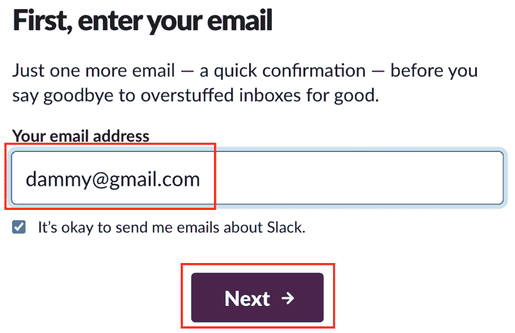

图 12.2 -输入您的电子邮件地址

2. 查看你从 Slack 收到的邮件中的**六位验证码**。

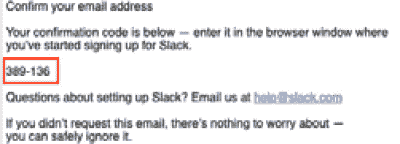

图 12.3 -检查六位数代码

3. 在输入电子邮箱并点击**下一步（Next）**后弹出的窗口中，输入验证码。输入完成后，系统会自动跳转到下一个窗口。

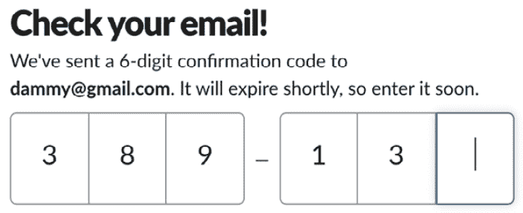

图 12.4 -输入验证码

4. 为你的工作区命名，然后点击**下一步（Next）**按钮：

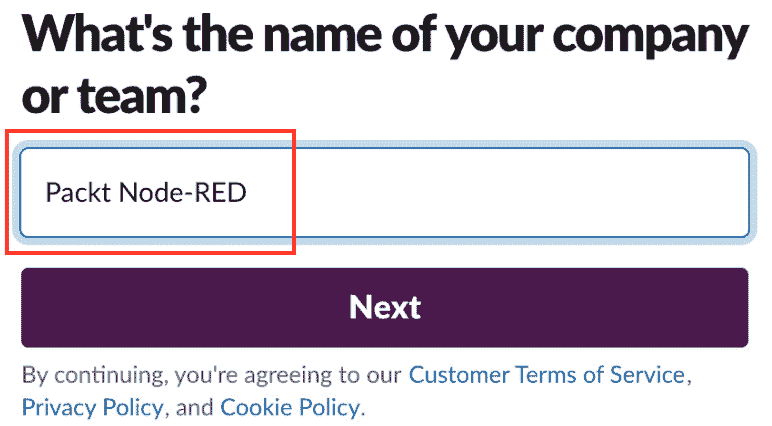

图 12.5 -为工作区命名

5. 在你的工作区中创建一个频道。你可以直接使用 **general** 频道，但我们还是创建一个专门用于实现聊天机器人的频道。这里我们将创建一个名为 **Learning Node-RED** 的频道：

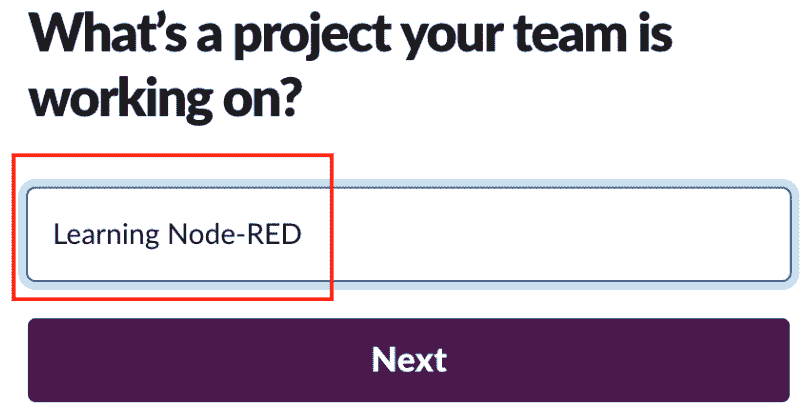

图 12.6 -您的工作区名称

6. 点击**暂时跳过（skip for now）**，不要添加队友：

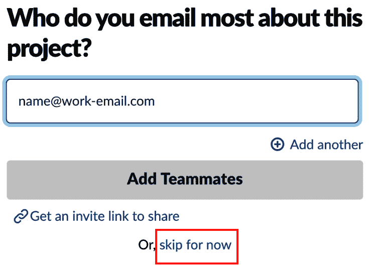

图 12.7 -本教程不需要队友

7. 点击**查看你的频道在 Slack**打开您创建的工作区:

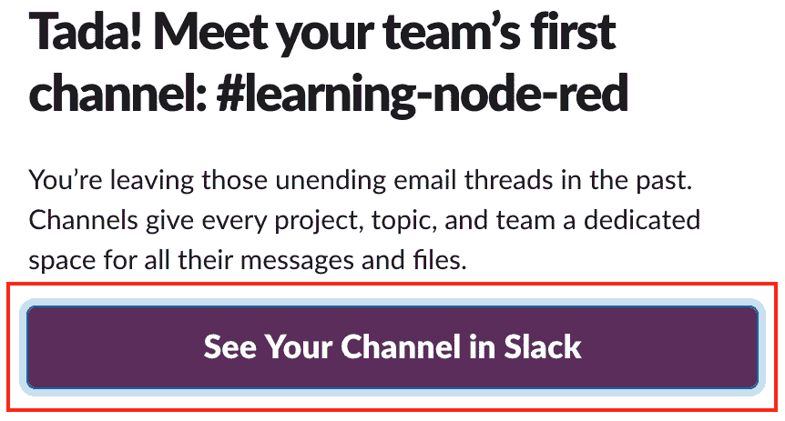

图 12.8 -单击“查看空闲通道

你已经为本教程创建了工作区:

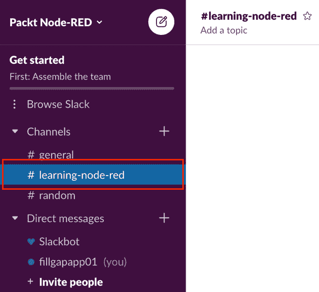

图 12.9 -您已经创建了工作区

重要提示

聊天机器人所在的频道最好是只有你参与的频道，除非你有公共目的。 这是因为对于不喜欢(或不感兴趣)聊天机器人的参与者来说，聊天机器人的运动可能会很嘈杂。

此时，你已经准备好了你的工作区和通道，可以在 Slack 中运行聊天机器人。 接下来，我们将创建一个机制，它将成为聊天机器人的引擎。

## 创建 Watson Assistant API

本教程使用 IBM 的**Watson Assistant API**作为聊天机器人的引擎。 Watson Assistant 可以使用自然语言分析来解释自然对话的意图和目的，并返回适当的答案。

有关沃森助手的详细信息，请访问:[https://www.ibm.com/cloud/watson-assistant-2/](https://www.ibm.com/cloud/watson-assistant-2/)。

要使用 Watson Assistant API，您需要在 IBM Cloud 上创建一个 Watson Assistant API 的实例。 按照以下步骤创建它:

1. 登录你的 IBM Cloud 控制台，在**目录（Catalog）**中搜索 **Assistant**，并在搜索结果中点击 **Assistant** 卡片。

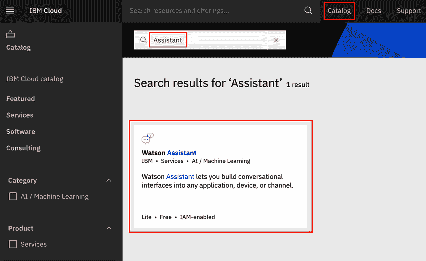

图 12.10 -搜寻沃森助手

2. 创建 Watson Assistant API 服务。为 Watson Assistant 服务数据中心选择区域。达拉斯（Dallas）节点较为稳定，因此这里我们选择达拉斯。

3. 定价套餐选择**Lite（免费版）**。服务名称、资源组等其他项目可保留默认值。

4. Click the **Create** button:

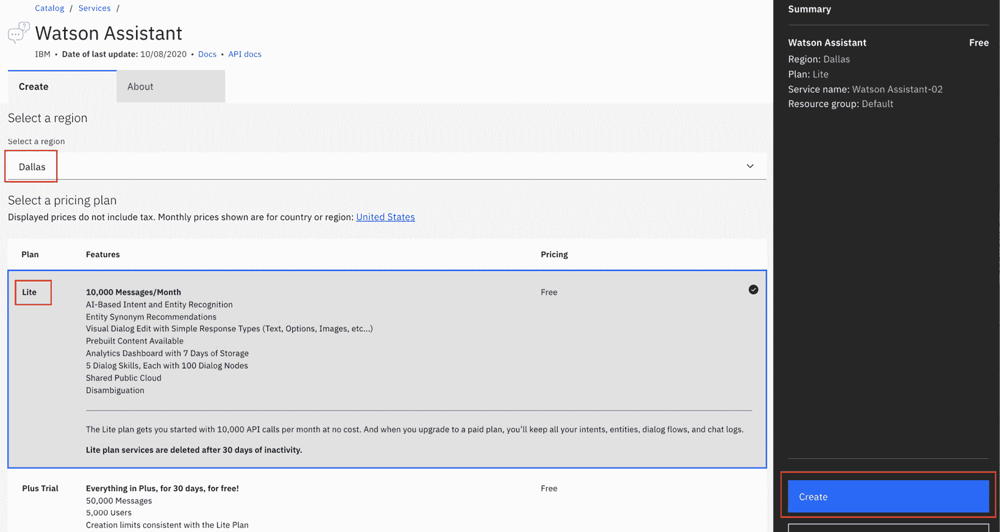

图 12.11 -创建一个 Watson Assistant 服务
5. 启动 Watson Assistant 工具。点击 **启动 Watson Assistant（Launch Watson Assistant）** 按钮，打开 Watson Assistant 控制台。

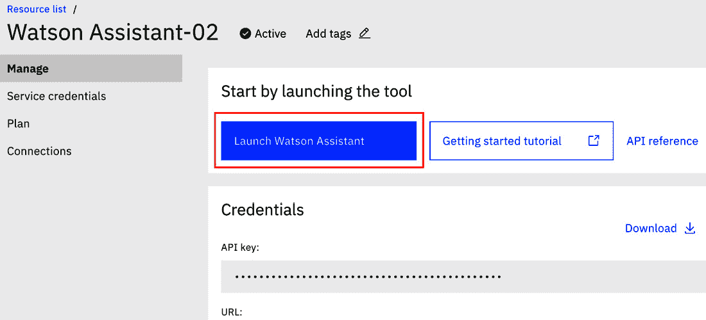

图 12.12 -启动 Watson Assistant 控制台
6. 在你的 **Watson Assistant** 服务中创建一个**技能（Skill）**。

当您第一次打开 Watson Assistant 控制台时，您将自动移动到**我的第一个技能**界面。

通常，您将在这里创建一个沃森助理技能，但本实践教程将侧重于 Node-RED，而不是如何使用沃森助理。 因此，通过导入预先准备好的定义文件，可以创建 Watson Assistant 中的一项技能。

如果你想创造自己的技能，那很好。 在这种情况下，Watson Assistant 的官方文档将会有帮助:[https://cloud.ibm.com/apidocs/assistant/assistant-v2](https://cloud.ibm.com/apidocs/assistant/assistant-v2)。

7. 在 Watson Assistant 控制台的侧边菜单中点击 **助手（Assistants）**，然后点击 **创建助手（Create assistant）** 按钮。

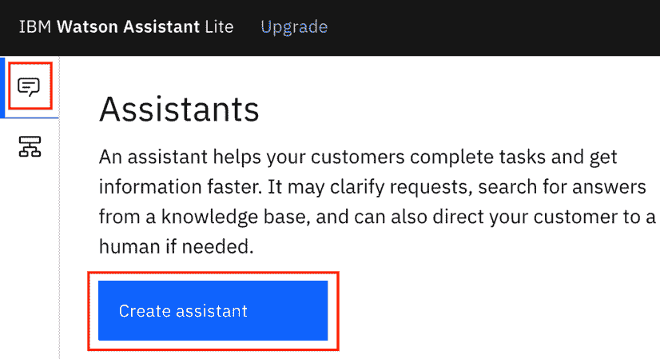

图 12.13 -创建助手菜单
这次我准备了一个技能，当被告知**told tell me a joke给我讲一个笑话**时，它会随机返回一个笑话短语。

8. 为此框架创建一个助手，将助手名称设置为 **Respond Joke Phrase**，然后点击 **Create assistant**（创建助手）按钮。

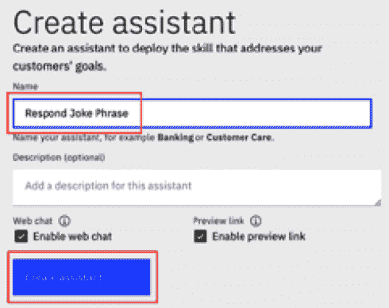

图 12.14 -创建助手
9. 导入 **Dialog**（对话）。当你的助手创建完成后，会显示该助手的设置界面。在该设置界面的 **Dialog**（对话）区域中，点击 **Add dialog skill**（添加对话技能）按钮。

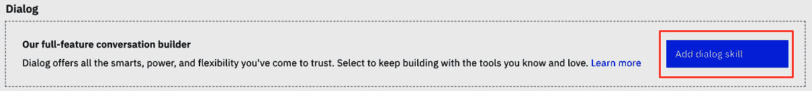

图 12.15 -添加对话框技能
10. 选择**Import skill**选项卡，选择要导入的技能的 JSON 文件。 在[https://github.com/PacktPublishing/-Practical-Node-RED-Programming/blob/master/Chapter12/skill-Respond-Joke-Phrase.json](https://github.com/PacktPublishing/-Practical-Node-RED-Programming/blob/master/Chapter12/skill-Respond-Joke-Phrase.json)下载此 JSON 文件。

11. 选中 JSON 文件后，点击**导入（Import）**按钮。

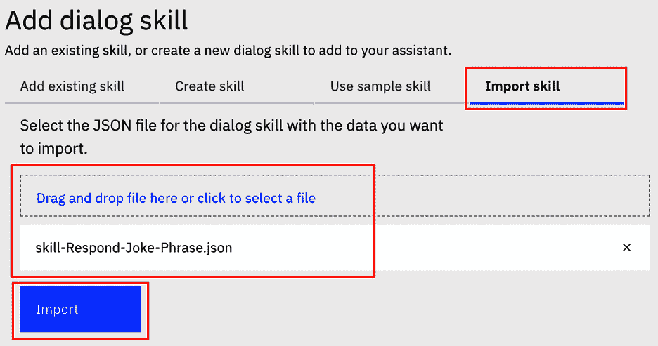

图 12.16 -导入对话框技能文件
你将看到**对话**区域中的**回应笑话短语**:

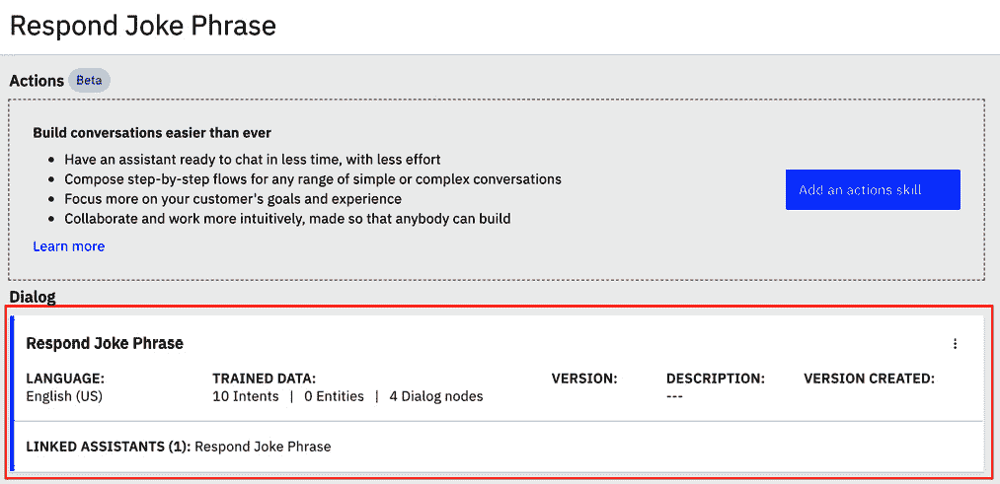

图 12.17 -对话框技能导入
12. 这就完成了技能导入。 您可以返回简单的问候语和笑话短语，所以尝试使用 Watson Assistant 控制台提供的**try it**功能进行对话:

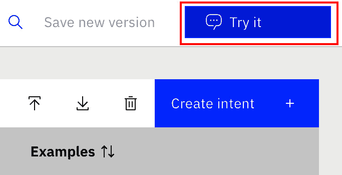

图 12.18—尝试一下

点击**Try it**按钮将打开聊天窗口。 试着在聊天窗口中键入接下来的对话:

```js
"Hello"; "Hi"; "Tell me jokes"; "Do you know any jokes?"; and so on…
```
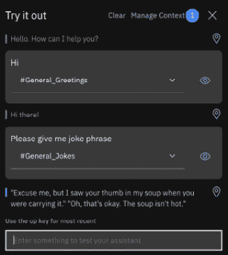

图 12.19 -测试会话

如果你没有得到一个好的答案，尝试另一个短语。 Watson 自然语言理解将 Watson Assistant 的**Try it out**窗口中所说的对话划分为意图或实体的类别。 如果会话没有被划分为所需的类，您可以在**Try it out**窗口中训练 Assistant API。

现在已经使用沃森助手创建了一个自动应答对话，还有一件事要做，那就是确认技能 ID。 这是稍后操作 Watson Assistant 作为 Node-RED API 时需要的 ID。

通过以下步骤检查**技能 Skills**屏幕上的技能 ID:

1. 在你创建的 **Skill** 卡片右上角，点击 **Skills** 菜单下的 **View API Details**（查看 API 详情）：

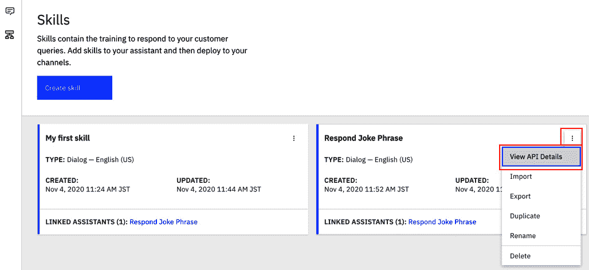

图 12.20 -访问 View API Details 菜单
2. 将显示的**技能 Skills ID**记录

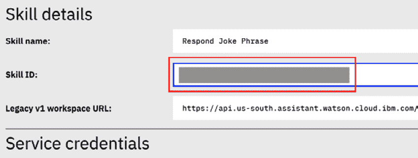

图 12.21 -检查并记录技能 ID

我们现在已经创建了一个自动响应聊天的聊天机器人服务。 接下来，让我们将其与 Slack 用户界面集成。

## 使能从 Node-RED 连接 Slack

接下来，让我们继续在 node - red 环境上准备一个 Slack 节点。 启动在 IBM Cloud 上创建的 Node-RED 流编辑器。

您在此步骤中所做的是在 node - red 环境中安装一个连接到 Slack 的节点。 这个方法很简单。 您所要做的就是从**管理面板(Manage palette)**窗口中找到并安装节点，这在其他章节中已经做过几次了。

按照以下步骤进行:

> 重要提示: 我相信 Node-RED 流编辑器在你的 IBM Cloud 已经创建一个服务(node . js 应用),但如果你还没有这么做,请参考[*第六章*](06.md)*,在云中实现 Node-RED*,创建一个 IBM Cloud 上 Node-RED 服务,在继续之前这一章。

1. 要在 Node‑RED 中使用 Slack，你需要安装 **node-red-contrib-slack** 节点，因此请点击 **管理面板（Manage palette）**。

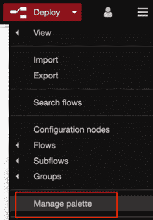

图 12.22 -打开 Manage 选项板窗口
2. 搜索 **node-red-contrib-slack** 节点，然后点击**安装（Install）**按钮。

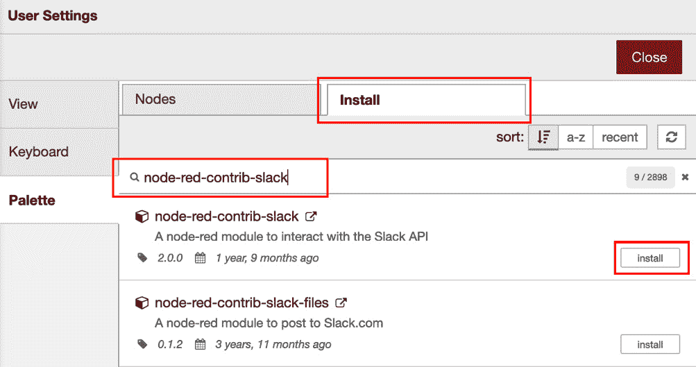

图 12.23 -安装 node-red-contrib-slack 节点
3. 在节点面板上，你会看到属于 **node-red-contrib-slack** 的四个节点。你需要准备好这些 Slack 节点，以便构建这个示例应用。

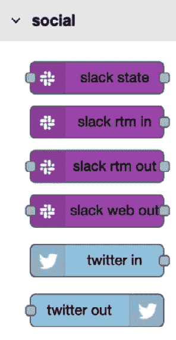

图 12.24 -松弛节点将出现在调色板上
4. 通过 Slack 客户端（桌面端或网页版）中的 **设置与管理（Settings & administration）** → **管理应用（Manage apps）**，进入 **Slack 应用目录（Slack App Directory）**，在你的 Slack 工作区中创建一个机器人。

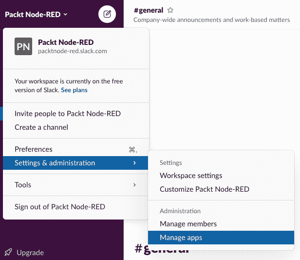

图 12.25 -选择 Manage apps
5. 进入 Slack 应用目录网站后，点击页面左上角的 **slack app directory**（Slack 应用目录）标志，进入 Slack 应用目录主页。

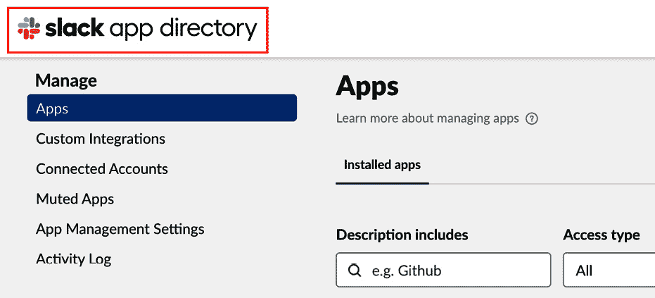

图 12.26 -访问 Slack App 目录
您也可以访问 Slack App 目录顶部页面，URL 为:**https://<您的工作区>.slack.com/apps**。

下面的 URL 只是一个示例:[https://packtnode-red.slack.com/apps](https://packtnode-red.slack.com/apps)。

这个 URL 是根据 Slack 上的每个工作区名称自动生成的。

6. 点击**获取基础应用（Get Essential Apps）**按钮，进入应用搜索窗口。

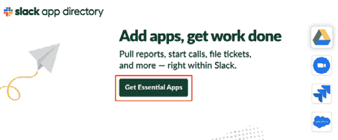

图 12.27 -点击 Get Essential Apps 按钮
7. 搜索关键词 **bots**，并在搜索结果中点击 **Bots**。

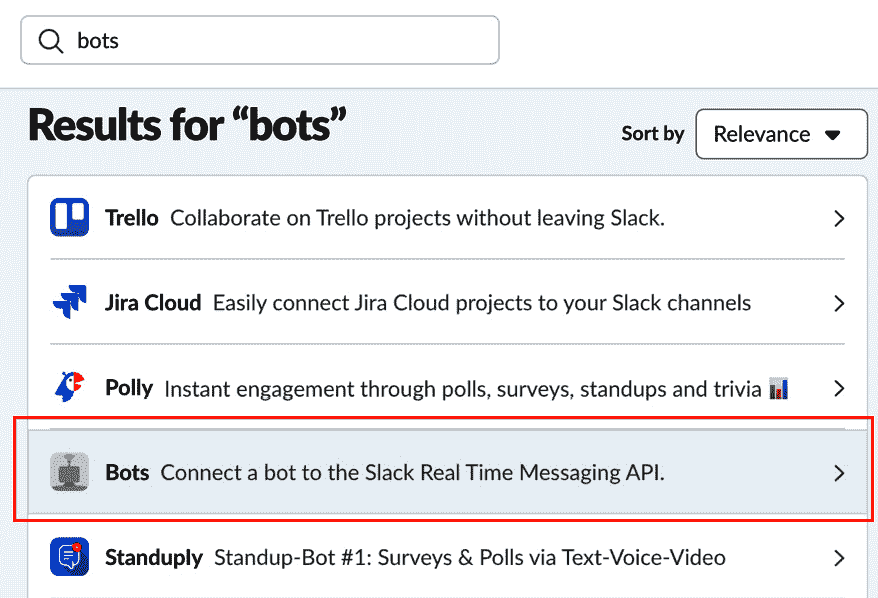

图 12.28 -搜索 Bots 并选择它

8. 在 **机器人（Bots**应用界面上，点击 **添加到Slack（Add to Slack**按钮。

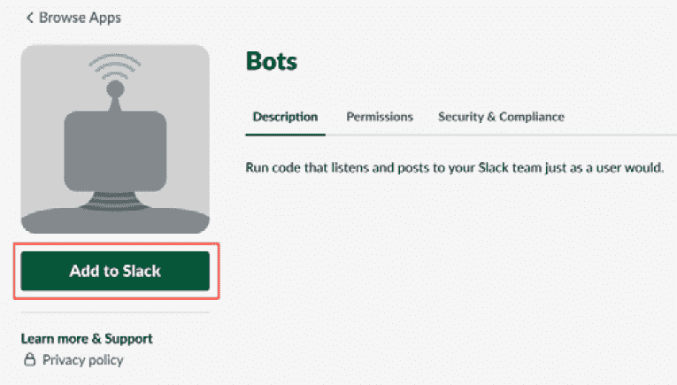

图 12.29 -将 Bots 应用添加到工作区

9. 使用您喜欢的任何名称设置此 bot 应用的**用户名**。 在本例中，我们将其命名为**packt-bot**。

10. Click the **Add bot integration** button:

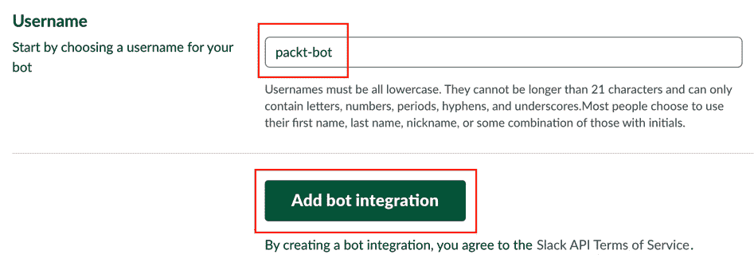

图 12.30 -设置你的机器人名称
11. 在下一个界面中，将会生成并显示用于使用该机器人的 API 令牌。请记下该令牌，以免遗忘。此 API 令牌将在使用 Node‑RED 创建流程时使用。

> 重要提示:  在与应用共享 bot 用户令牌时要小心。 不要在公共代码存储库中发布 bot 用户令牌。 这是因为任何人都可以使用这个 API 令牌访问机器人。

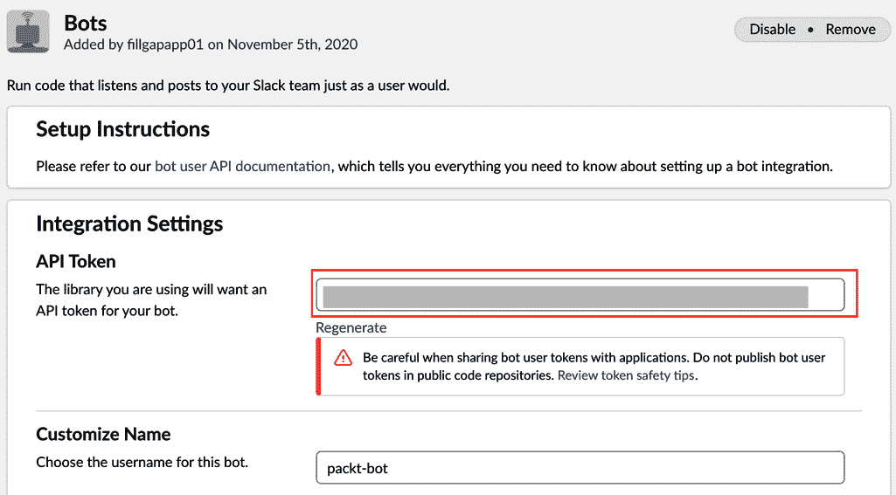

图 12.31 -确认 API 令牌
12. 点击**Save Integration**按钮完成 bot app 集成:

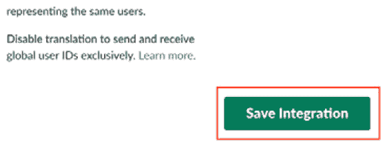

图 12.32 - Bot 应用集成完成

现在你准备好了。 让我们继续讨论流创建过程。

## 构建聊天机器人应用

到目前为止，您已经在 Watson Assistant 中创建了一个聊天机器人引擎，创建了一个 Slack 工作区，并集成了 Bot 应用，您可以在该 Slack 工作区中使用它。

在这里，我们将把这些服务与 Node-RED 结合起来，并创建一个与 Node-RED 结合的机制，以便机器人在 Slack 的工作空间中进行对话时能够进行应答。

按照以下步骤创建一个流:

1. 将 Watson Assistant 连接到 Node‑RED。通过 IBM Cloud 上的**资源列表（Resource list）**访问你的 Node‑RED 服务控制台。选择**连接（Connections）**选项卡，然后点击**创建连接（Create connection）**按钮。

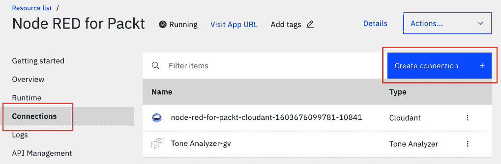

图 12.33 -在 Node-RED 上创建一个新连接
2. 选择你创建的 Watson Assistant 服务，然后点击**下一步（Next）**按钮。

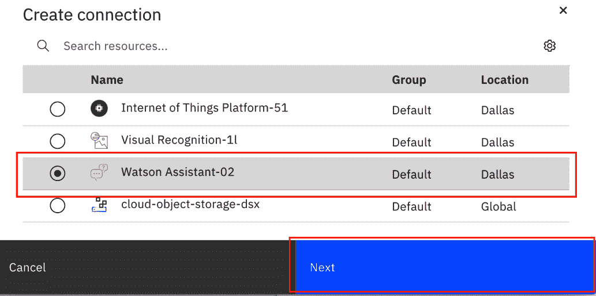

图 12.34 -在 Node-RED 上创建一个新连接

3. 点击带有默认选项的 **Connect**（连接）按钮，完成连接设置。执行此操作将会重启 Node‑RED 应用，整个过程需要几分钟才能完成。

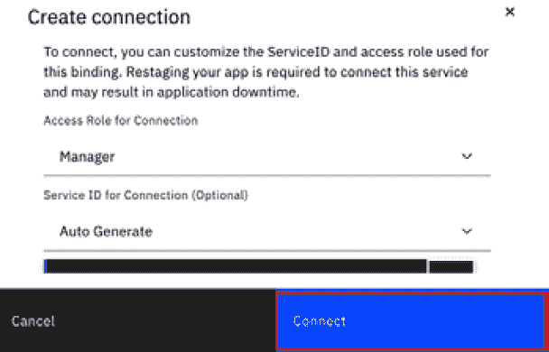

图 12.35 -在 Node-RED 上完成创建新连接

4. Make the flow to handle conversations on Slack.

   您已经有了 Slack 节点和 Watson 节点，可以在本教程中使用。

5. 放置一个 slack-rtm-in 节点、两个 function 节点、一个 assistant 节点、一个 slack-rtm-out 节点和一个 debug 节点。放置完成后，按照下图所示的顺序将它们用连线连接起来:

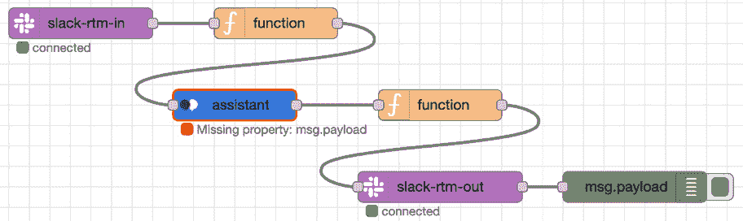

图 12.36 -放置节点并连接它们

6. 为每个节点设置参数:

   按照这个过程设置每个节点上的参数。 对于需要编码的节点，编码如下:

   * The **slack-rtm-in** node:

- a 点击编辑按钮(铅笔图标)，打开**属性**面板:

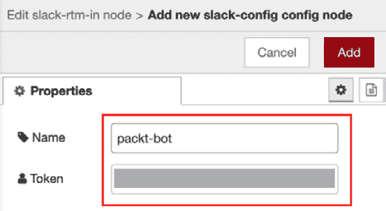

图 12.37 -打开属性面板

- b 输入您在 Slack Bots 应用中生成的**Token**值。您可以为该配置设置任何名称。 在这个例子中，它被命名为**packt-bot**:


图 12.38 -设置连接 Slack 应用的配置属性

当您回到该节点的主面板时，您将看到已经在**Slack Client**属性中设置了配置。

- c 点击**完成**按钮关闭该设置:

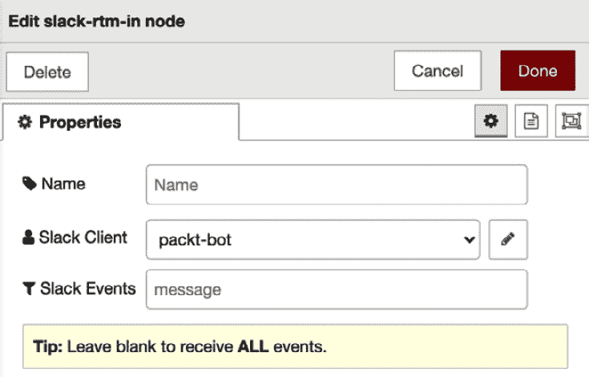

图 12.39 -完成 load -rtm-in 节点的属性设置

* The **function** node (first one):

  a)在第一个**function**节点中，输入以下内容:

```js
global.set("channel",msg.payload.channel);
msg.topic = "message";
msg.payload = msg.payload.text;
return msg
```
也可以参考下图:
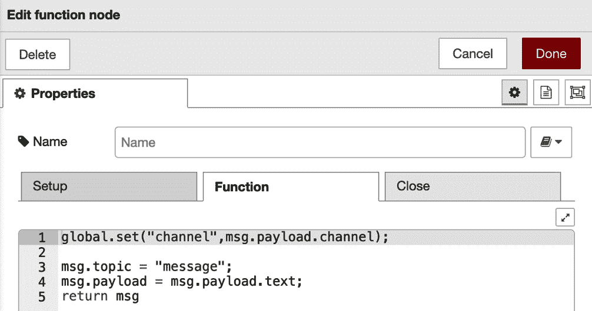

图 12.40 -第一个功能节点编码

在这个函数节点中，在 Slack 上发布的消息将从从 Slack 发送的 JSON 数据中取出，并放入**msg.payload**。

另一个重要的过程是将 Slack 发送的信道信息存储在 Node-RED 的 Global 变量中。 存储在这里的信道信息将在稍后向 Slack 发送响应消息时使用。

The **assistant** node:

在上一步中，您将 Watson Assistant 连接到 Node-RED。 这意味着您可以在不使用 API 密钥或秘密的情况下从 Node-RED 调用助理 API。

当我双击**assistant**节点打开设置面板时，我看不到任何属性，比如 API 键。 如果您在设置面板中看到它们，这意味着 Watson Assistant 和 Node-RED 连接进程失败。 在这种情况下，再次执行连接过程。

这里只需要设置一个属性。 在**assistant**节点的设置面板中，将您之前写下的沃森助手技能 ID 设置为**工作区 ID**属性:

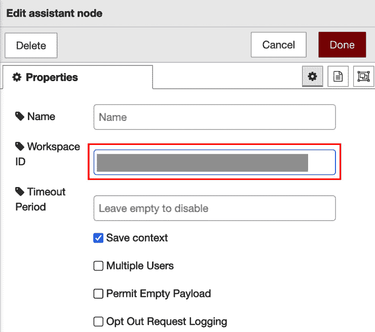

图 12.41 -将 Skill ID 设置为工作区 ID

至此，完成了**assistant**节点的设置。 保存您的设置并关闭设置面板。

* **function** 节点（第二个）：

  在第一个**function**节点中，输入如下代码:

```js
var g_channel=global.get("channel");
msg.topic = "message";
msg.payload = {
    channel: g_channel,
    text: msg.payload.output.text[0]
}
return msg
```
也可以参考下图:
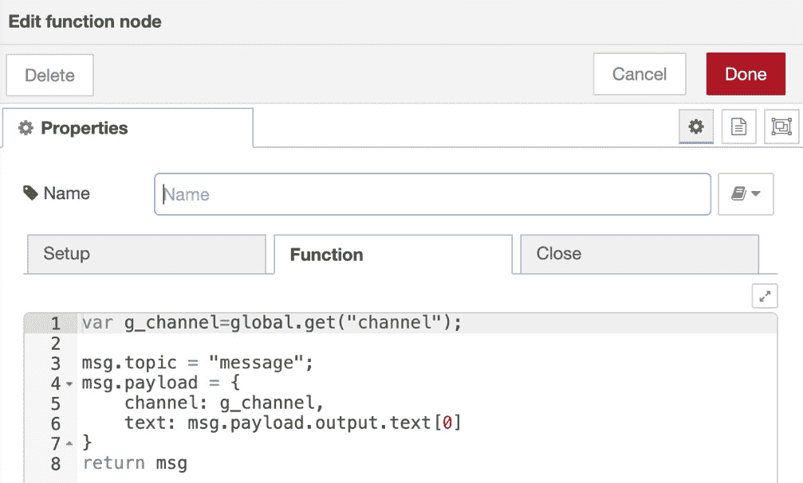

图 12.42 -第二个函数节点编码

第二个函数节点存储自动回复消息回来沃森在**msg.payload.text** 助理,和得到了松弛频道信息保存在第一个函数节点并将其存储在**msg.payload.channel**。

***The **slack-rtm-out** node:

其次是**slack-rtm-out**节点，设置简单:

a)双击**slack-rtm-out**节点，进入设置面板。

b)您将看到您创建的名为**packt-bot**的配置已经被放置在这个节点属性中。 如果尚未设置，请从下拉列表中手动选择。 点击**Done**，设置完成:

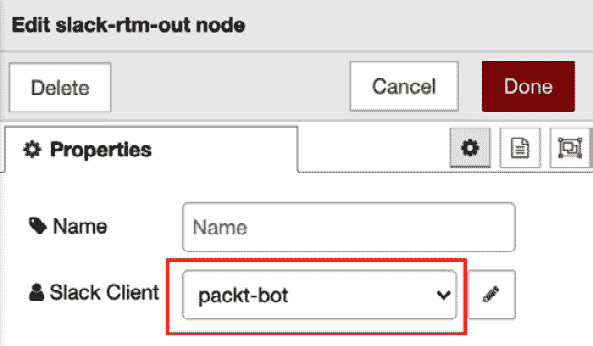

图 12.43 -检查 slack-rtm-out 节点的属性设置

* The **debug** node:

  这里的调试节点只是输出日志。 无需设置。

1. 在 Slack 上查看机器人应用:

   一个自动应答聊天机器人已经被创建使用 Slack。 让我们试试对话。

2. 在你Slack工作区中创建的频道里，添加你已集成的机器人应用，并点击频道中的**Add an app**链接。

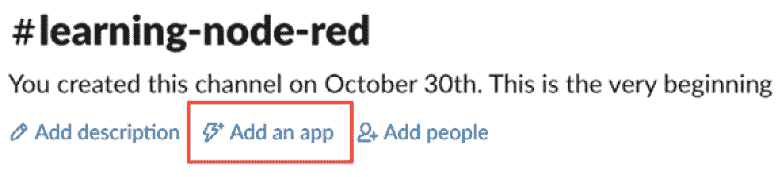

图 12.44 -单击 Add an app 链接
3. 点击**Add**按钮将 bot 应用添加到您的频道:

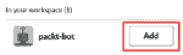

图 12.45 -添加您创建的 bot 应用

现在，我们来谈谈。 提到和跟你的机器人(**packt-bot**在这个例子中)通道上添加这机器人应用。因为只有对话我们正在学习华生助理是问候和听笑话,我们将发送一个消息从松弛,似乎与这两种。

首先，让我们打个招呼。 你会看到一种问候式的回应:

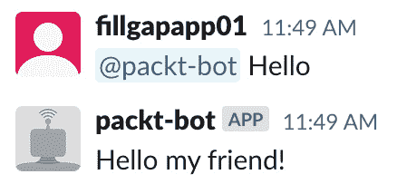

图 12.46 -与聊天机器人交换问候

然后给发一个信息，像**Please tell me a joke**。 它会随机地回复一个机器人选择的笑话:

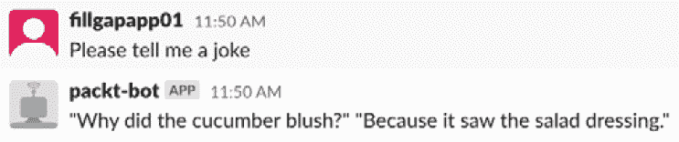

图 12.47 -聊天机器人回答一些笑话

伟大的工作! 您最终使用 Node-RED 创建了聊天机器人应用。

如果您希望流配置文件在 Node-RED 环境中创建此流，可以在这里获取:[https://github.com/PacktPublishing/-Practical-Node-RED-Programming/blob/master/Chapter12/slack-watson-chatbot-flows.json](https://github.com/PacktPublishing/-Practical-Node-RED-Programming/blob/master/Chapter12/slack-watson-chatbot-flows.json)。

## 小结

在本章中，我们体验了如何使用 Slack、Watson 和 Node-RED 制作聊天机器人应用。 这一次，我们使用 Slack 作为聊天平台，但你可以使用任何有 api 的聊天平台，比如 LINE、Microsoft Teams 等等，而不是 Slack。

本章对于创建任何非物联网应用也很有帮助。 Node-RED 可以通过链接任何 Web API 来开发各种应用。

在下一章中，让我们开发自己的节点。 当然，它可以在任何环境中使用。 使用 node - red 开发您自己的节点意味着开发一个不能使用现有节点完成的新节点。 这无疑是 Node-RED 高级用户的第一步。
