# 十三、在 NodeRed 库中创建并发布自己的节点

到目前为止，我们已经使用准备好的节点了解了 Node-RED。 在本章中，您将学习如何创建自己的节点并将其发布到库中。 在完成本章的教程后，您将能够发布您自己的节点，供世界各地的开发人员使用。

让我们从以下几个话题开始:

*   创建自己的节点
*   在本地环境中测试您自己的节点
*   将您自己的节点作为模块发布到 node - red 库中

在本章结束时，您将掌握如何创建自己的节点。

## 技术要求

要在本章取得进展，你需要具备以下条件:

*   一个 GitHub 账号:[https://github.com/](https://github.com/)。
*   npm 账户:[https://www.npmjs.com/](https://www.npmjs.com/)。
*   Node-RED(在本地环境中独立)。
*   IBM 云帐户。
*   本章使用的代码可在**第 13 章**文件夹[https://github.com/PacktPublishing/-Practical-Node-RED-Programming](https://github.com/PacktPublishing/-Practical-Node-RED-Programming)中找到。
*   本教程的步骤基本上是在 Mac 上进行的。如果您使用的是 Windows PC，请将命令和文件路径替换为您的环境。

## 创建自己的节点

在开发节点之前，您需要首先了解一些事情。 以下策略是为节点开发设置的。 让我们遵循这些并开发一个节点。

在创建新节点时，需要遵循一些一般规则。 它们遵循核心节点所采用的方法，并提供一致的用户体验。

您可以在 node - red 官方网站[https://nodered.org/docs/creating-nodes/](https://nodered.org/docs/creating-nodes/)上查看节点创建规则。

### 节点程序开发

Node-RED 节点由两个文件组成:一个 JavaScript 文件定义处理过程，另一个 HTML 文件提供一个 UI，例如设置屏幕。 在 JavaScript 文件中，创建的节点负责的处理被定义为一个函数。 这个函数被传递一个包含节点特定属性的对象。 HTML 文件描述 Node-RED 流编辑器显示的属性设置屏幕。 在这个 HTML 文件中显示的属性设置屏幕上输入的设置值将从 JavaScript 文件调用并处理。

这里，我们将创建一个 GitHub 存储库，但如果你只想创建一个节点，你不需要一个 GitHub 存储库。 在本章中，我们将使用 GitHub 存储库将创建的节点发布到库中，所以我希望您在这一步的开始就创建存储库。

请执行以下步骤来创建一个 GitHub 存储库:

1.  去[https://github.com/](https://github.com/)并登录你的 GitHub 帐户。
2.  Select **New repository** from the **+** dropdown at the top right of the GitHub page:

    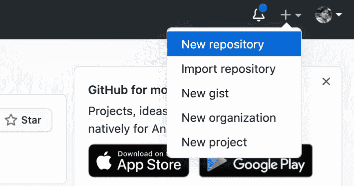

    图 13.1 -为自己的节点创建存储库

    这里创建的存储库是作为一个开发节点的项目存在的，然后它将被打包并发布到 npm 中。 (当然，发布它是可选的。)

    因此，确保存储库名称符合节点开发的命名约定。

    GitHub 存储库名称将与节点名称相同。 在节点创建规则中，节点名称必须是**node-red-contrib-<名称，表示一组节点>**，因此相应地指定 GitHub 存储库名称。 在本例中，它是**node-red-contrib-taiponrock**。

3.  指定存储库名称后，将存储库公开范围设置为**Public**，检查 README 文件，并指定 license。 在本例中，它是用 Apache License 2.0 创建的。
4.  设置完所有内容后，点击**创建存储库**按钮创建一个存储库:

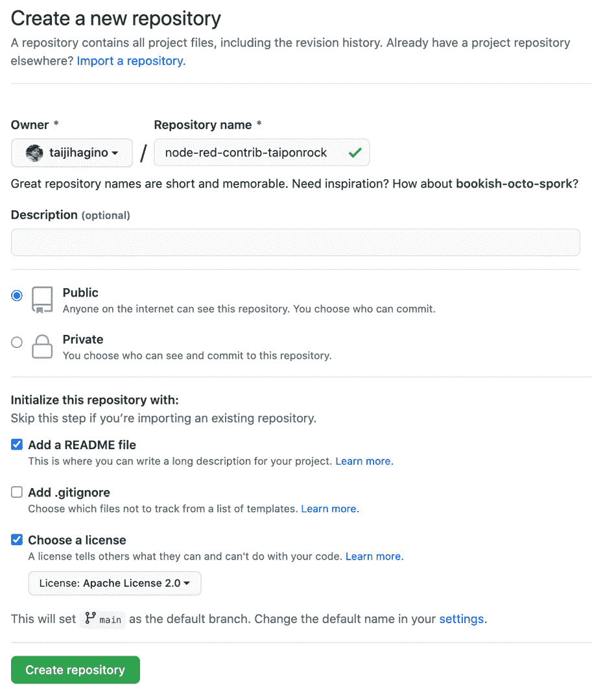

图 13.2 -存储库被创建为一个公共项目

你现在已经创建了你的 GitHub 存储库。

现在让我们按照以下步骤将刚刚创建的存储库克隆到本地开发环境中:

1.  将仓库URL复制到剪贴板。点击绿色的**Code**下拉菜单，然后点击**clipboard 剪贴板**按钮复制该URL。


    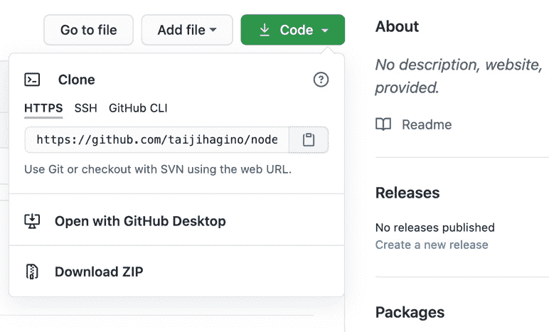

    图 13.3 -复制 URL 来克隆这个存储库

    从**Bash**可以运行的命令行界面(比如终端)本地克隆存储库(git 克隆)。

2.  导航到你想要克隆（复制）该仓库的工作目录。此处，我在 **user**目录下创建了一个 work 目录，并切换到了该目录下：

```bash
    $ mkdir work

    $ cd work
```
3.  使用你之前创建的仓库的 URL 执行 git clone 命令：

```bash
$ git clone https://github.com/<GitHub account>/node-red contrib-<Any specified string>.git
```
4.  克隆完成后，使用 **ls** 命令确认仓库已成功克隆：

```bash
    $ls
    node-red-contrib-<Any specified string>
```
    现在让我们创建一个 JavaScript 文件。

    从这里开始，我们将创建实际的节点处理。 但别担心，代码已经准备好了。 所提供的代码对于处理节点来说非常简单。 这只是将作为输入传递的字符串转换为小写字母的问题。

5.  首先切换到克隆下来的仓库目录下：

```bash
    $ cd node-red-contrib-<arbitrary specified string>
```
6.  在该目录下，创建一个文件名为 node.js 的文件，代码如下所示：

```js
module.exports = function(RED) {
    function LowerCaseNode(config) {
        RED.nodes.createNode(this,config);
        var node = this;
        node.on('input', function(msg) {
            msg.payload = msg.payload.toLowerCase();
            node.send(msg);
        });
    }
    RED.nodes.registerType("lower-case",LowerCaseNode);
}
```
已创建**node.js**。

    现在让我们创建一个 HTML 文件。

7.  在同一目录下创建一个文件名为 node.html 的文件，代码如下所示:

```js

<script type="text/javascript">
    RED.nodes.registerType('lower-case',{
        category: 'function',
        color: '#a6bbcf',
        defaults: {
            name: {value:""}
        },
        inputs:1,
        outputs:1,
        icon: "file.png",
        label: function() {

 return this.name||"lower-case";
        }
    });

</script>
<script type="text/html" data-template-name="lower-case">
    <div class="form-row">
        <label for="node-input-name"><i class="icon- 
          tag"></i> Name</label>
        <input type="text" id="node-input-name"  
          placeholder="Name">
    </div>
</script>
<script type="text/html" data-help-name="lower-case">
    <p>A simple node that converts the message payloads  
        into all lower-case characters</p>
</script>

```

node.html 文件已创建完成。该 HTML 文件负责你所创建节点的用户界面（UI）及样式设计。正如前文所述，一个节点始终由一个 HTML 文件和一个 JavaScript 文件组成。

该节点的实现已基本完成。接下来，让我们将创建好的节点进行打包，以便部署。

### 节点打包

我们已经完成了节点的业务逻辑（JavaScript 代码）和外观界面（HTML 代码）的开发，现在该对其进行打包了。在 Node-RED 中，流程编辑器本身是一个 Node.js 应用程序，而运行在其上的每个节点同样也是 Node.js 应用程序。也就是说，此处的打包操作需通过 npm 来完成。

本文暂不对 npm 展开详细讲解。若你想了解更多相关内容，可访问 npm 官方网站或查阅各类技术文章：https://www.npmjs.com/。

现在，使用 npm 命令执行以下步骤：

1. npm 初始化。在创建 node.js 和 node.html 文件的目录同级路径下，执行以下命令：

```bssh
$ npm init
```
2. 运行 npm init 时，系统会交互式询问你各种参数，请根据你的需求进行输入。以下是我使用的参数：

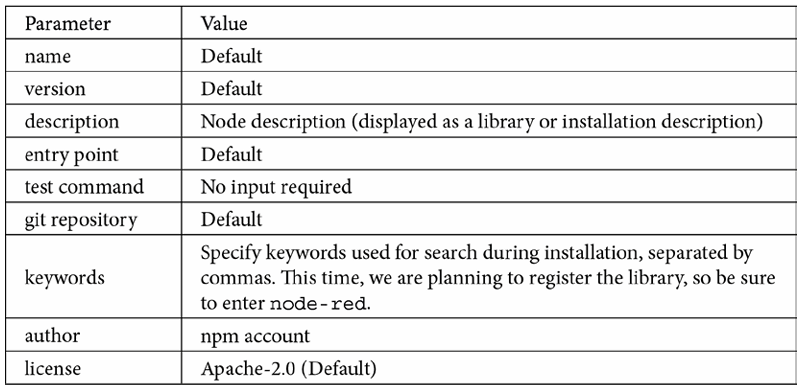

完成此步骤后，`npm init` 命令会生成一个 package.json 文件。

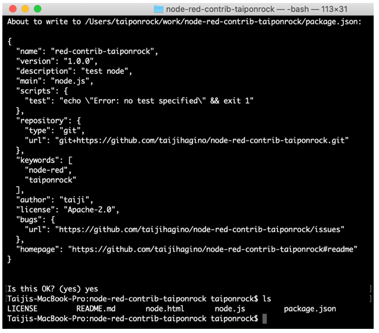

    图 13.4 – npm init

3. 编辑 package.json 文件。你需要手动在 package.json 中添加 Node-RED 专属配置项。使用文本编辑器打开 package.json 文件，在 JSON 结构中与 "name" 和 "version" 同级的位置新增以下属性：
"node-red": {"nodes": {"lower-case": "node.js"}}

```js
{
   "name": "node-red-contrib-<arbitrary string  
     specified>",
   "version": "1.0.0",
   (abridgement)
   "node-red": {
     "nodes": {
       "lower-case": "node.js"
     }
   },
   (abridgement)
}
```

以下截图可作为参考，能帮你完成该属性的添加操作：

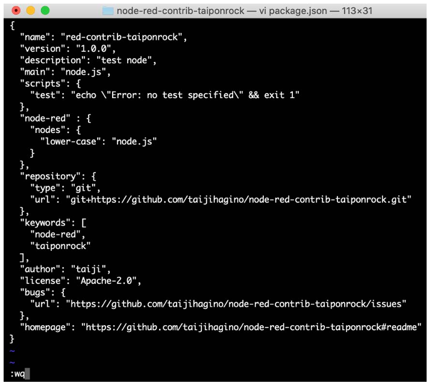


 图 13.5 – 编辑 package.json 文件


至此，自定义节点的打包工作就完成了。接下来，我们将实际使用这个节点。

### 在本地环境测试自定义节点

你已完成自定义节点的开发。接下来，我们将把迄今创建的节点添加到本地环境的 Node-RED 中。

对于自定义节点来说，在本地检查其运行情况至关重要。若未确认节点在自身环境中可正常工作，就将其发布到互联网上，这对众多开发者而言都是不妥的。

因此，在本节中，你将在本地环境对自定义节点进行测试。

### 节点安装

你可以使用 `npm link` 命令在本地测试节点模块。该命令允许你在本地目录开发节点，并在开发过程中将其链接到本地安装的 Node-RED。

操作方法十分简单，只需遵循以下步骤：

1. 在命令行界面（CLI）执行以下命令，添加节点并启动 Node-RED：

```bash
$ cd <path to node module>
$ npm link 
```

此操作会为该目录创建相应的符号链接，Node-RED 会在启动时识别到这个节点。若修改了节点文件，只需重启 Node-RED 即可使节点文件的更改生效。

2. 在命令行运行 node-red 命令启动本地 Node-RED。如果已经启动，则重启。

重启后，你应该能看到一个名为 lower case 的节点已经被添加到面板的 function 分类中。

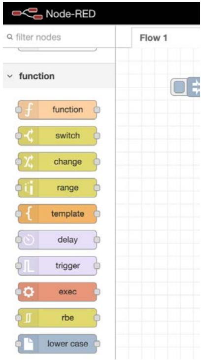

    图 13.6 – 已添加 lower case 节点

3. 我们来验证它能否正常使用。依次连接 **inject**、**lower case**、**debug** 各节点来创建一个流程。

4. 对于 inject 节点的属性，将其设置为字符串类型，并将其输出内容设为任意全大写的字符串，例如：MY NAME IS TAIJI。

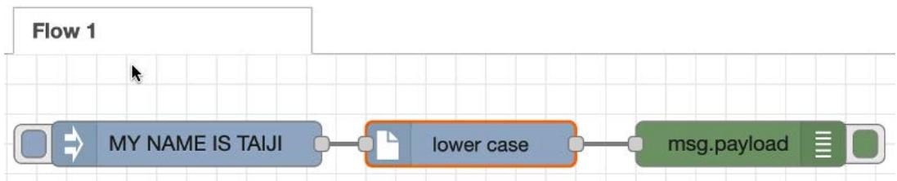


图 13.7 – 制作流程


5. 部署你创建的流程并执行 inject 节点后，你可以看到，全大写字符串作为该流程的参数，被转换为全小写字符串并输出到 debug 面板。

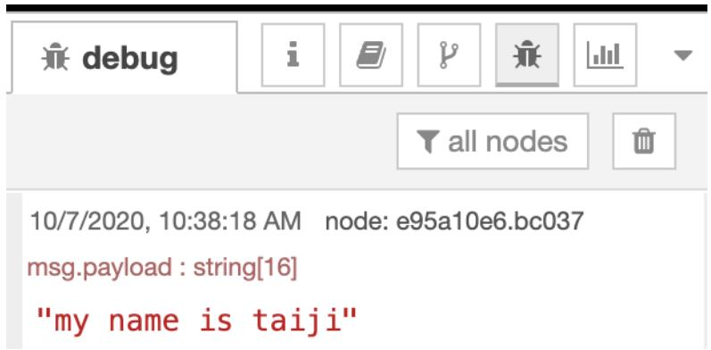

图 13.8 – 流程运行结果


接下来，我们来看看如何自定义一个节点。

### 自定义节点

我已经确认自己创建的节点可以在本地环境中使用。接下来，我们将对这个节点进行自定义。
通过修改 JavaScript 和 HTML 文件，可以编辑节点的功能与外观。
这些修改会在重启 Node-RED 后生效。

#### 修改节点名称（Node-RED 自定义节点）

目前，已创建节点的节点名称仍然是示例程序中的 lower‑case 版本。在这里，将该名称修改为你喜欢的任意名称。每个节点都必须拥有唯一名称，因此你应选择一个尚未被使用的名称。按照以下步骤修改节点名称：

1. 将 package.json 文件中描述的 lower‑case 改为你自己的节点名称。

在示例中，节点的仓库是 node‑red‑contrib‑taiponrock，因此将其修改为 taiponrock 节点。

下面是修改前的 package.json 文件内容：

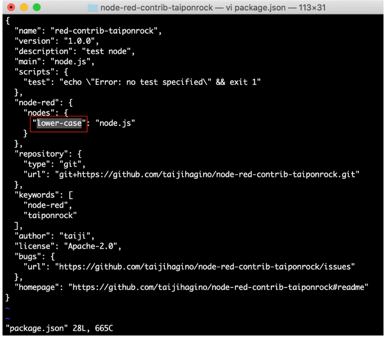

图 13.9 – 修改 package.json 文件之前

而修改后的文件内容如下：

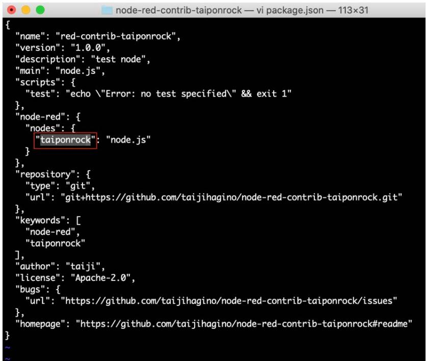

图 13.10 – 修改 package.json 文件之后


2. 将 node.js 文件中写有的 lower-case 和 LowerCaseNode 改为你自己的节点名称。

例如，将 lower-case 改为 taiponrock，将 LowerCaseNode 改为 TaiponrockNode。

以下是修改前 node.js 文件的内容：

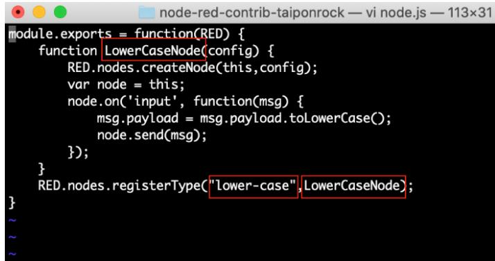

图 13.11 – 修改 node.js 文件之前

以下是修改后 node.js 文件的内容：

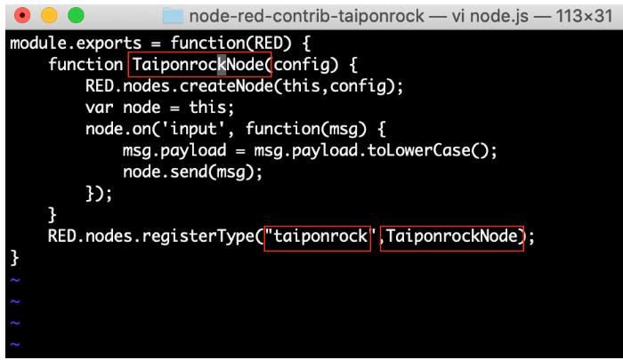


图 13.12 – 修改 node.js 文件之后

3. 将 node.html 文件中写有的 lower-case 改为你自己的节点名称。

例如，将 lower-case 改为 taiponrock。

以下是修改前 node.html 文件的内容： 


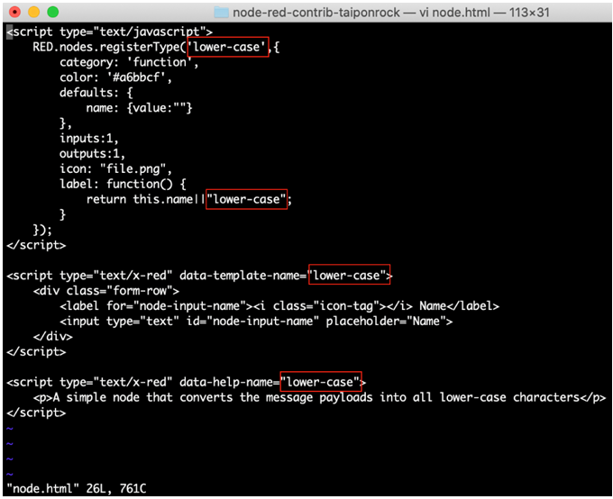

图 13.13 – 修改 node.html 文件之前

以下是修改后 node.html 文件的内容：

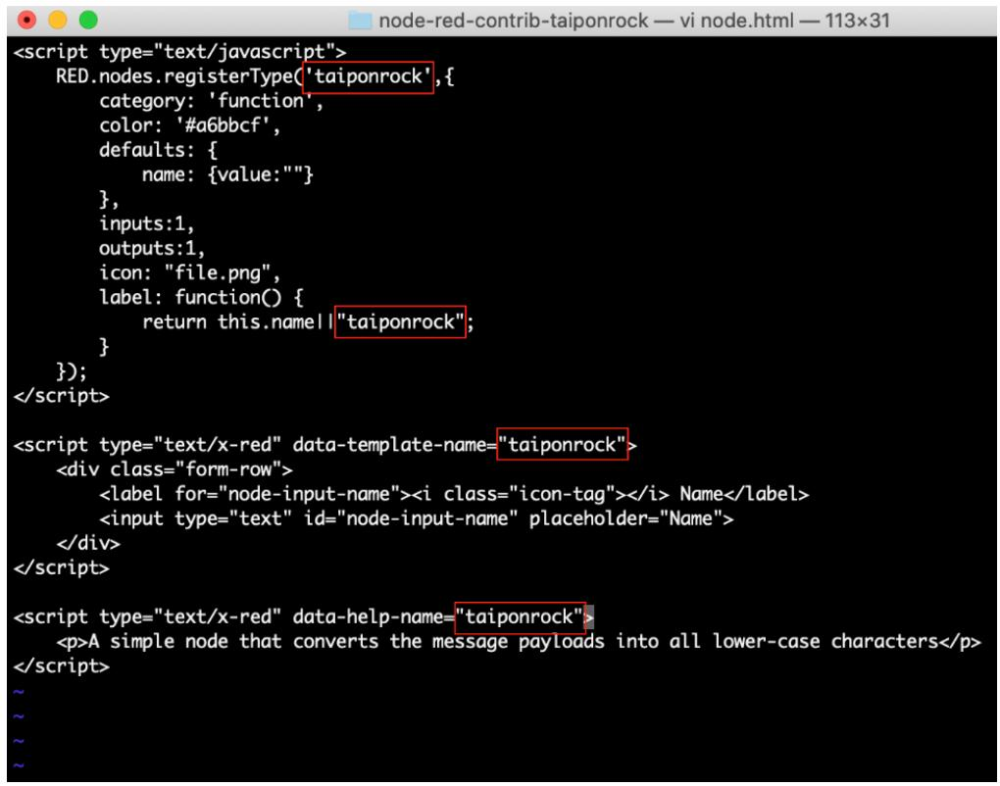

图 13.14 – 修改 node.html 文件之后


重启 Node-RED 后，你可以看到节点已被正确重命名：

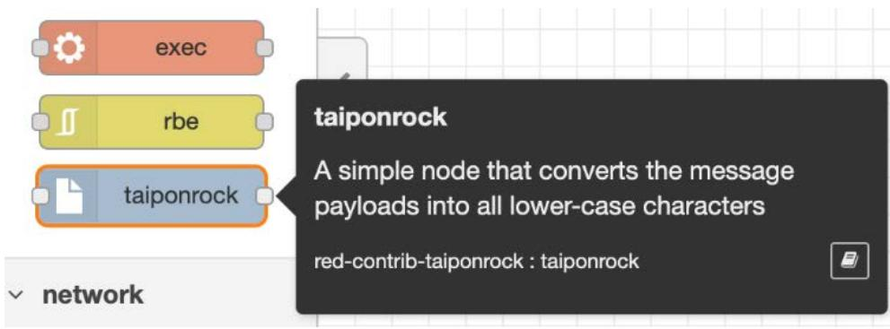

图13.15 – 节点已重命名

接下来，我们将介绍如何修改特定节点的代码：

#### 修改节点代码

实现节点处理功能的主要部分如下：

1. 修改代码。你可以通过重写 node.js 中这部分定义的 `msg.payload = msg.payload.toLowerCase();` 代码，来更改节点的处理逻辑：

```js
    (abridgement)
    node.on ('input', function (msg) {
     msg.payload = msg.payload.toLowerCase ();
     node.send (msg);
    }
(abridgement)

```
在此处，为了让操作更易理解，我们将其修改为仅返回你的姓名或昵称字符串的方法。

2. 请按如下方式重写 node.js 文件：
```js
    (abridgement)
    node.on ('input', function (msg) {
     msg.payload = "Taiponrock";
     node.send (msg);
    }
    (abridgement)
```
3. 执行流程

现在我们来查看是否已完成修改。使用你之前创建的流程。此流程中的小写转换节点已被替换为名称和处理逻辑均已修改后的节点，但需要重新部署并启用。为便于理解，先删除原本的小写转换节点，再重新添加该节点。

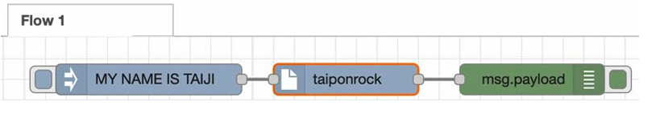

图13.16 – 将你创建的节点替换为重命名后的节点并执行

4. 检查结果。部署创建好的流程并执行注入节点后，你会在调试标签页中看到本“修改节点代码”小节中设为常量的字符串（姓名或昵称）。

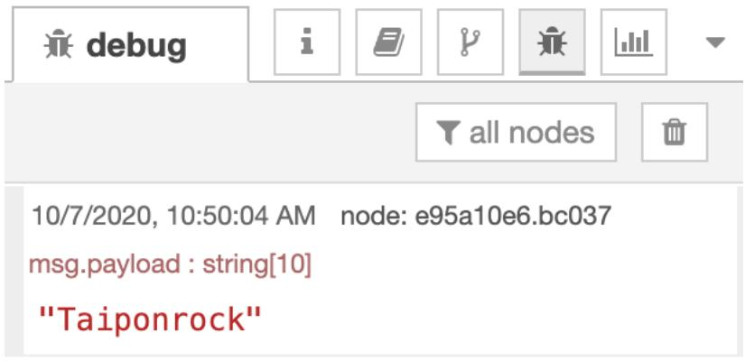

图13.17 – 此流程的执行结果

在下一小节中，我们将介绍一些可用于节点自定义的其他选项。

#### 其他自定义选项

除节点名称外，还可以通过多种方式自定义节点，例如节点颜色、节点图标、节点分类、节点功能等。详情请参阅官方文档：https://nodered.org/docs/creating-nodes/appearance。

我们已在本地环境完成节点的测试与自定义，接下来将节点发布到 Node-RED 库中。

## 将自有节点作为模块发布到 Node-RED 库

本节将把创建好的节点发布到 Node-RED 库。这需要进行一些准备工作。到目前为止，你已创建自有节点并确认仅能在本地环境使用。既然是你创建的专属节点，不妨将其发布到互联网，供全球用户使用。为此，需要将节点发布到名为 Node-RED 库的平台，地址如下：https://flows.nodered.org/。

> 重要提示：Node-RED 库是社区驱动的节点与流程发布平台。因此应避免发布不完整或无实用价值的节点。这是为了让 Node-RED 用户能够找到所需节点，不希望出现大量无用节点混杂其中。

因此，尽管本章会讲解节点发布方法，请不要发布测试节点或仅为示例级别的节点。

### 发布你创建的节点

按照以下步骤将自有节点发布到 Node-RED 库：

1. 完善 README.md 文件。

我们将在 README.md 文件中撰写节点说明。考虑到英语是通用语言，建议使用英语编写。

例如，建议包含以下内容：

- 概述说明
- 节点使用方法
- 截图
- 使用该节点的示例流程
- 前置环境要求
- 更新日志

本节作为实操教程，仅在 README.md 文件中撰写概述与使用方法。请将 README.md 文件更新为以下内容：

```shell
    # node-red-contrib-<Any specified string>
    ## Overview
    This node is a node for forcibly converting all the 
    alphabet character strings passed as input to the 
    character string "Taipon rock".
    Even if the input parameter passed is not a character 
    string, "Taiponrock" is forcibly returned.
    In this process, it is a wonderful node that changed the

    sample node that was executing toLowerCase, which is an 
    instance method of String object in JavaScript, to a 
    process that just returns a meaningless constant.

    ## how to use
    It is used when you want to forcibly convert all the 
    character strings of the parameters to be passed to 
    "Taiponrock".


```
2. 上传文件——确保目录下包含以下五个文件：node.js、node.html、package.json、README.md 和 LICENSE（若包含 package-lock.json 文件也无妨）：

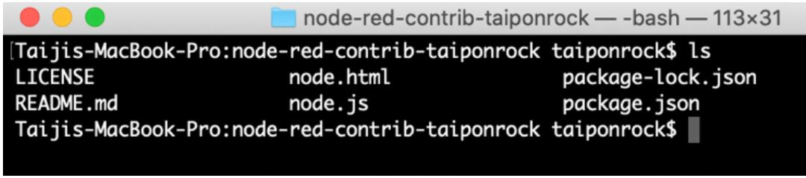

图13.18 – 核对这五个文件

将这些文件上传至 GitHub 上的代码仓库。你本应在克隆后的仓库目录中完成相关操作，若当前处于其他目录，请切换至该仓库目录。随后执行以下命令：

```shell
$ git add .
$ git commit -m "Node has been published"
$ git push 
```

当推送操作无错误完成后，你可以在 GitHub 上的代码仓库中看到目标文件已完成上传：

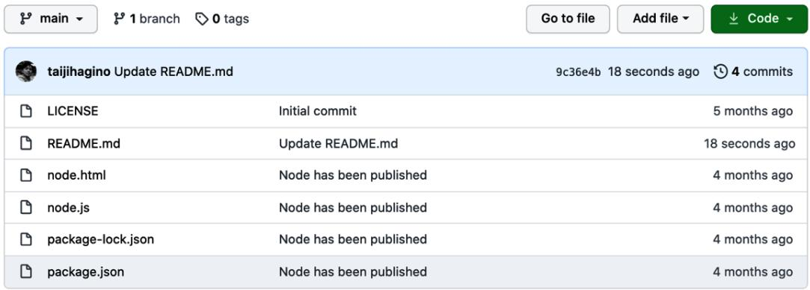


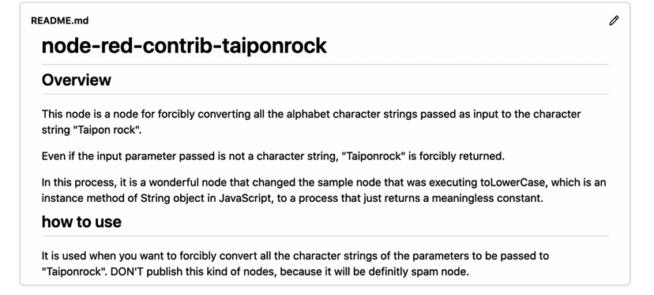


图13.19 – 节点文件已上传

3. 发布节点（执行 npm publish 命令）

接下来将该节点作为模块发布。使用 npm 命令上传这组文件。请再次确保在克隆后的仓库目录中执行操作：

```shell
$ npm adduser 

$ npm publish 
```
执行 `npm publish` 命令时，系统会要求确认版本号。若后续再次执行 `npm publish`，必须更新版本号，因此别忘了编辑 `package.json` 文件来提升版本号。

当发布操作正常完成后，节点将发布至地址：https://www.npmjs.com/package/node-red-contrib-<任意字符串>。

示例地址为：https://www.npmjs.com/package/node-red-contrib-taiponrock（注：原文示例地址少连字符，按 Node-RED 节点命名规范补充 `-`，更符合实际场景）。

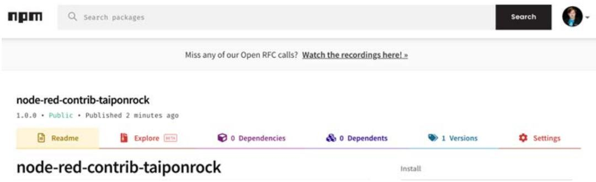

图13.20 – 你的节点已发布至 npm 平台

4. 从 Node-RED 库的“添加节点”功能中注册已创建的节点。

5. 在“将你的节点添加到流程库（Add your node to the Flow Library）”页面中，输入你创建的节点名称，然后点击“添加节点（add node）”按钮：

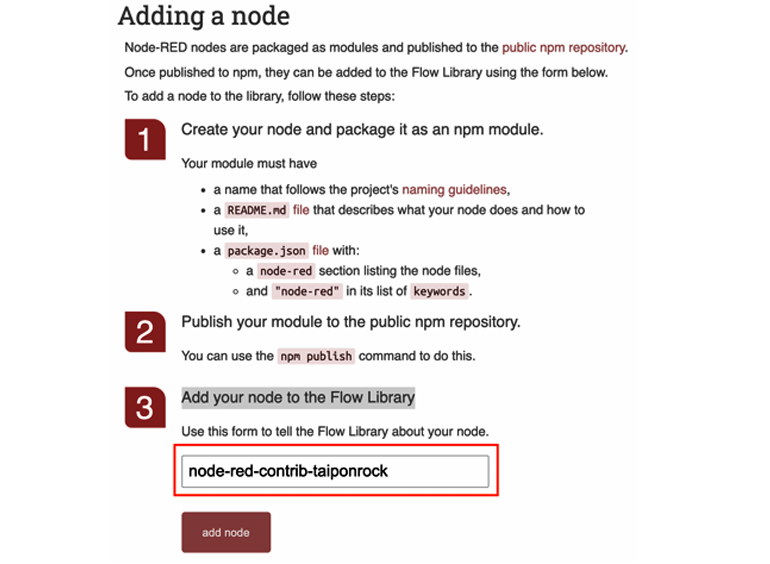

图13.21 – 将你的节点添加到 Node-RED 库

注册完成后，你会看到已创建的节点已添加至该库中：

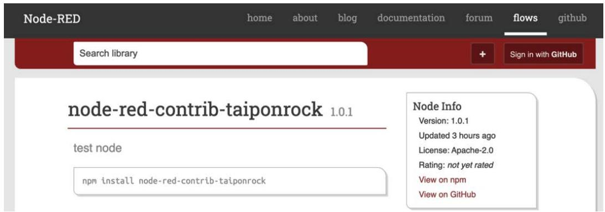

图13.22 – 你的节点已发布到 Node-RED 库

新节点的注册大约需要15分钟。请注意：如果节点尚未在 Node-RED 库完成注册，你在 Node-RED 流程编辑器中将无法找到该节点。

如果你升级了版本并重新发布，请在 Node-RED 库中打开你的节点页面，刷新页面，并点击节点界面右侧操作面板里的 **check for update**（检查更新）。

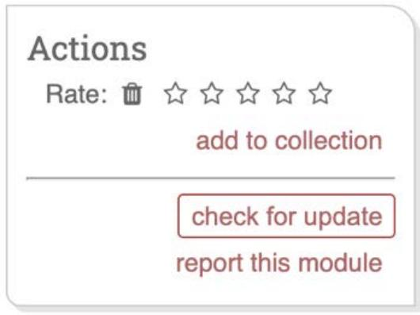

图13.23 – 检查节点状态的更新情况

接下来，我们介绍如何删除你已发布的节点。

### 删除已发布的节点

删除已发布的节点时需格外谨慎。截至2020年10月，根据 npm 的包撤销发布（unpublish）政策，撤销发布的时限为发布后的24至72小时内。此外，对于满足特定条件、影响范围较小的包（例如发布超过72小时但下载量不足300次），也可申请撤销发布。

该政策信息可能会不定期更新，最新内容请参考 npm 官方网站：https://www.npmjs.com/policies/unpublish。

完成撤销发布操作后，请按照更新节点时的相同方式，在 Node-RED 库中打开你的节点页面并刷新。点击节点页面右侧“操作（Actions）”面板底部的“请求刷新（request refresh）”按钮。

执行撤销发布操作时，需在模块目录（即克隆的仓库目录）中运行以下命令：

```shell
$ npm unpublished --force node-red-contrib- <arbitrary string> 
```

若该命令执行成功，则说明模块撤销发布操作已完成。

## 安装你已发布的节点

建议在完成节点添加至 Node-RED 库的操作后，至少等待15分钟再进行安装。

在本地环境的 Node-RED 中，我们已直接应用了自制节点并可正常使用；同时也将其发布至 npm 平台，并在 Node-RED 库完成了节点注册。现在，任何人都可以使用这个节点了。

接下来，我们将从 IBM Cloud 的 Node-RED 环境中测试验证本次创建的节点是否能正常安装和使用，请按以下步骤操作：

1. 登录 IBM Cloud，创建 Node-RED 服务，并启动 Node-RED 流程编辑器。

2. 在流程编辑器中打开“管理面板（Manage Palettes）”：

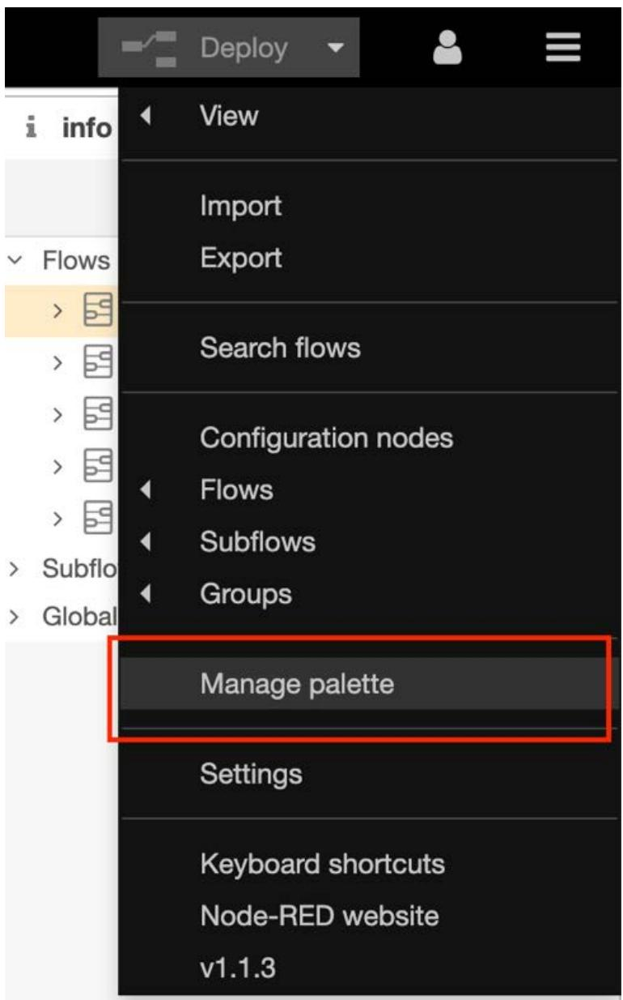


图13.24 – 进入节点管理面板

3. 切换到「安装（Install）」选项卡，在搜索框中输入你创建的节点名称。
如果搜索结果中显示了你创建的节点，说明该节点已公开并可安装。

4. 点击「安装（Install）」按钮进行安装。

如果没有出现在搜索结果中，说明节点注册后还未等待满15分钟。请等待30分钟或1小时后再试。如果仍然找不到节点，可能存在其他问题，请检查之前的操作步骤后重试。

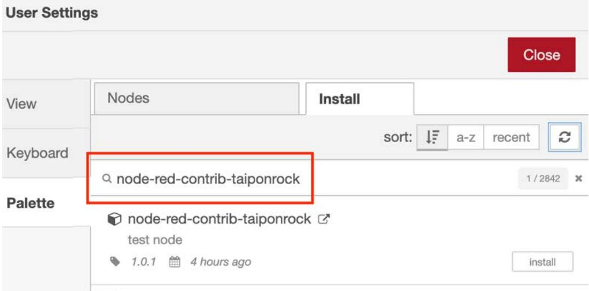


图13.25 – 搜索并安装你创建的节点

5. 确认面板中已安装你创建的节点后，按下图所示创建流程，并执行注入节点（inject node）：

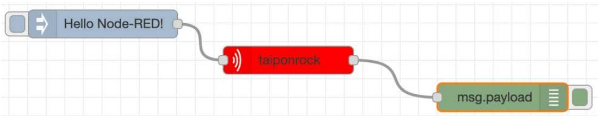

图13.26 – 搭建流程

本示例中，我们将自制节点插入到 Node-RED 流程编辑器首次启动时默认生成的流程之间。

6. 运行注入节点后，验证调试窗口中是否显示了预期结果：

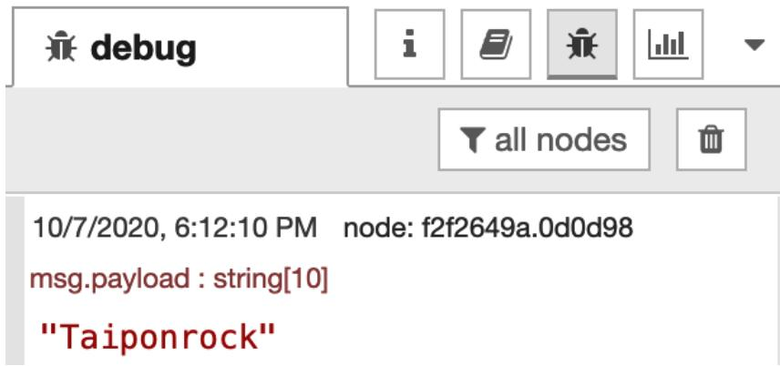

图13.27 – 该流程的运行结果

做得很好！你现在已经掌握了如何制作并发布自定义节点。

## 本章小结

恭喜你！在本章中，你学习了如何创建自定义节点、如何对节点进行自定义设置，以及如何从 Node-RED 库或本地进行安装与使用。创建自定义节点并没有你想象的那么难。按照本章节的步骤编写处理逻辑并设置外观，你就可以发布一个实用且独一无二的自定义节点，供全球的开发者使用！

此外，在本书的最后，我将简要介绍 Node-RED 用户社区，敬请留意。